# 肿瘤免疫学

<aside>
💡

**Information:** Created by Ruilin Xu, 2024/9/11.

</aside>

# 肿瘤免疫与肿瘤免疫概论

---

### 9月11日

1. 实体瘤占恶性肿瘤97%（血液瘤即白血病），上皮性肿瘤占实体瘤92%，十大高发肿瘤都是上皮起源肿瘤。
2. **手术（**容易造成损伤，产生表皮生长因子，肿瘤容易利用其实现复发；同时CD8 T细胞、NK细胞容易在此过程中出现效应减弱**）、放化疗（**化疗给药易清除造血细胞，导致免疫效应减弱，而给药——暂停给药的反复过程更会使得肿瘤细胞产生耐药性**）**仍然是主要治疗手段。目前**化疗、放疗、靶向治疗**及免疫治疗都可能出现耐药反应。
3. 我国恶性肿瘤患者术后3个月复发转移率50%，6个月复发转移率69%，80%的恶性肿瘤患者常死于复发转移。
4. HIV主要攻击CD4 T细胞，因此容易出现淋巴瘤。
5. 细胞因子治疗剂量控制不佳，可能导致诸多负作用；DC疫苗（DC细胞负载前列腺癌相关抗原）通过递呈抗原来延长肿瘤患者生存期（约4个月）。
6. CTLA-4的负作用较PD-1更大，因此较anti PD-1使用频率更少。
7. 肿瘤细胞具有多种抗原：肿瘤特异性抗原（TSA）、癌-睾丸抗原（CT antigen，也可视为TSA，同时由于血睾屏障，男性也可进行治疗）、肿瘤相关抗原（TAA）、新抗原（Neoantigen，新的抗原表位突变）。
8. CTL细胞特异性识别（可能为肿瘤抗原的某个表位），通过直接接触实现杀伤作用；NK细胞的杀伤作用机制与CD8 T细胞一致，但其为非特异性识别肿瘤细胞，其通过肿瘤细胞MHC I类分子的表达减少（CD8 T细胞需要通过MHC I类分子递呈抗原肽才可实现识别）来实现非特异性识别；巨噬细胞可以通过ADCC、吞噬、分泌介质（如IFN-α、TNF-α、补体等）、递呈抗原等方式实现抗肿瘤；DC细胞表面MHC II类分子极多，从而为抗原递呈作用最强的免疫细胞。肿瘤微环境中的DC细胞大多不成熟，无法起到识别递呈肿瘤细胞的作用；肿瘤细胞也可以产生免疫球蛋白，因此肿瘤微环境中可以发现大量IgG，同时并非B细胞所产生。
9. 肿瘤细胞免疫逃逸的方式：Fas/FasL介导的免疫逃逸。Fas在所有细胞上都具备，是死亡信号分子，而FasL是细胞类型特异性的受体（如CD8 T与NK细胞）；肿瘤抗原的突变；肿瘤细胞表面MHC分子表达缺陷或表达量降低；肿瘤细胞通过非经典HLA分子（HLA-G和HLA-E）抑制NK细胞的杀伤作用；肿瘤细胞协同刺激分子（T细胞活化：第二刺激分子）及黏附分子（LFA-1/ICAM-1）表达下降；肿瘤细胞可自分泌或旁分泌一些免疫抑制性细胞因子如IL-10，TGF-β（可诱导肿瘤细胞纤维化）等；诱导免疫细胞功能耗竭（肿瘤细胞产生PD-L1诱导T细胞表面PD-1耗竭、肿瘤细胞产生的IgG可以通过唾液酸受体诱导T细胞耗竭）；诱导抑制性免疫细胞（Treg、MDSC、TAM、TAN等）。
10. 免疫治疗：主动免疫治疗有：肿瘤细胞疫苗、肿瘤蛋白疫苗、肿瘤抗原肽疫苗、DNA疫苗、DC疫苗、新抗原（患者肿瘤样本的全基因组测序/RNA测序，测定TCR/BCR突变后，从患者外周血进行T细胞的刺激实验，如果发现T细胞出现活化，产生IFN-γ干扰素，则鉴定为新抗原）与mRNA疫苗。被动免疫治疗有：单克隆抗体治疗；免疫活性细胞的过继性免疫治疗（通过输注抗肿瘤免疫效应细胞的方法，增强肿瘤患者的免疫功能，如LAK细胞、CIK细胞、TIL、CD8 T细胞）；嵌合抗原受体修饰（CAR-T及TCR-T）的T细胞疗法；打破肿瘤免疫抑制微环境（免疫检查点治疗，阻断免疫抑制信号、激活天然免疫系统、针对TAM和MDSC的治疗）；肿瘤联合治疗（靶向治疗与免疫治疗、免疫治疗联合化疗、免疫治疗联合放疗）

# 肿瘤抗原

---

### 9月13日

1. 抗原特征：免疫原性、抗原性
2. 抗体对抗原的识别与BCR对抗原的识别机制一致（二者均为免疫球蛋白，Ig抗体为游离的免疫球蛋白，而BCR为表达在B细胞表面的免疫球蛋白）；CAR-T为改造将抗体表达在T细胞表面，以识别抗原可变区。
3. TCR具有多样性和简并性：Neoapeptipe-specific T cell（TCR不一样，但是识别相同的抗原）；交叉反应性T细胞（同一TCR可以识别不同抗原。目前测定，一个TCR可识别100w种）。
4. 肿瘤抗原：细胞癌变过程中出现的新抗原、肿瘤细胞异常或过度表达的抗原物质的总称。产生途径：修饰变化、转移过程中结构的改变、高突变率产生等。
5. 肿瘤抗原的机制分类：**（1）自身抗原**：胚胎抗原或分化抗原，胚胎期表达，出生后消失或仅留微量，如CEA（CD66，正常<10ng/ml）为糖基化的膜蛋白，属于Ig超家族，在结肠癌、胰腺癌、胃癌、乳腺癌患者的血清中水平升高；以及甲胎蛋白（AFP，正常时<20ng/ml）这一循环糖蛋白，在肝细胞癌、生殖细胞癌中表达及癌-睾抗原。**（2）异常糖基化修饰的脂和蛋白质**。**（3）组织特异性分化抗原**，如CD20在非霍奇金淋巴瘤和胸腺瘤表达，PSA（前列腺特异蛋白，正常<4ng/ml）在前列腺癌中表达。**（4）肿瘤新生抗原**，为基因突变产物，具有免疫原性。**（5）致癌病毒表达的肿瘤抗原**，为同一病毒诱导的肿瘤表达相同的肿瘤抗原，均一性较好，感染患者都具备。如EBV-EBNA-1抗原（B细胞淋巴瘤、鼻咽癌）和HPV-E6/7抗原（宫颈癌）
6. 肿瘤抗原的特异性分类：**（1）肿瘤特异性抗原TSA**，肿瘤细胞特有的，不存在于正常细胞（来自突变或致癌病毒蛋白）为肿瘤新生抗原；**（2）肿瘤相关抗原TAA**，肿瘤细胞和正常细胞均表达的抗原，含量在细胞癌变期显著增加。
7. 肿瘤抗原的鉴定：**（1）小鼠肿瘤特异性抑制抗原的鉴定：**接种的肿瘤细胞在小鼠体内无生长，说明具有较强的肿瘤抗原表达；若肿瘤生长，则不存在或肿瘤抗原表达较弱。**（2）人类肿瘤抗原的鉴定：**基于免疫应答基础的文库筛选，如CTL克隆（获得患者的肿瘤细胞，建立肿瘤cDNA文库并转染，并获得CTL细胞进行克隆，若转染后的靶细胞被CTL杀伤，则说明为肿瘤抗原，并可知DNA序列；反之。MAGE-1即通过此方法鉴定出。这种识别出的肿瘤抗原已可以使得机体产生免疫应答）与SEREX方法（制备肿瘤cDNA文库，通过噬菌体转染膜展示方法将其提呈到细胞表面，利用血清反应与否进行筛选肿瘤抗原）；肽洗脱法（将结合肽段的MHC分子从细胞表面洗脱，IP拉下MHC-抗原肽复合物，找到可与MHC结合的肽段，再验证是否被T细胞识别等）；基于二代测序的筛选方法（Somatic mutation，找肿瘤新生抗原，识别患者HLA分型，通过Somatic mutation与HLA分型是否能够相互识别来确定neoantigen。Mutant peptides——MHC I binders——T-cell recognition——Processed in tumor cells——Immunogenicity）；基于组学的筛选方法；反向免疫学法（表位预测、实验验证）
8. 新抗原分类：Guarding（直接诱导产生免疫防御与监视作用，通常体内检测不到，因已经反应）/Restrained（反应强度较低，疫苗接种后可能产生）/Ignored（不能诱导初始T细胞，但可以诱导记忆T细胞） neoantigen。
9. 抗原特异性T细胞对多肽的识别：ELISpot（IFNγ）；检测抗原肽特异T细胞的频数（一个亲和素结合四个生物素分子，故可如下进行实验：折叠——生物素化——四聚体化——流式检测频数。Monomer与TCR的亲和力较弱，较难稳定结合；而四聚体化后可稳定结合TCR）；T-Scan高通量筛选，扫描全基因组抗原表位；Yeast-display libraries of pHLA。
10. 肿瘤相关抗原：p53、HER-2、TOPO2α、MUC1等蛋白在肿瘤细胞中显著高表达。
11. ADC：细胞毒药物连接到靶向肿瘤的单克隆抗体，结合靶向药物和化疗药物（无特异性）的特点，可实现精准治疗（理想抗原在肿瘤细胞表达水平高，肿瘤组织中异质性低，正常细胞中表达水平相对较低；且从细胞上脱落概率小，防止在治疗循环中药物不能作用于靶细胞）。
12. 过继免疫治疗：分离TILs（黑色素瘤常用，其他肿瘤类型不常使用，受TILs数量与分离技术影响）；取外周血（PBMC+肿瘤抗原+IL2、TCR-T细胞、CAR-T细胞等。CAR-T实际模仿TCR-CD3复合物的结构，将VH和VL通过linker连接作为胞外段，胞内段主要以CD3进行信号传递）。
13. 组织新生抗原MART-1，gp100高亲和力TCR。

# 肿瘤疫苗

---

### 9月14日

1. 肿瘤免疫编辑：指肿瘤发生发展过程中免疫系统控制和重塑肿瘤的过程，包括免疫监视（此时免疫细胞可对肿瘤进行杀伤监视）、免疫平衡（检测不到肿瘤细胞存在，对患者无症状，免疫细胞与肿瘤细胞处于平衡状态）、免疫逃逸（肿瘤细胞形成突变，逃逸免疫细胞的控制，出现临床上可见的肿瘤）三个阶段。
2. 靶向治疗的最大问题是耐药。
3. 主动免疫治疗：疫苗；被动免疫治疗：细胞因子、过继免疫细胞、抗体；免疫检查点抑制剂。
4. 预防性疫苗：与肿瘤发生有关的病毒疫苗，如HBV/HCV——原发性肝癌；HPV——宫颈癌；EBV——鼻咽癌；HTLV——成人T细胞白血病。对于预防性疫苗，主要通过体液免疫应答进行防范，而对于治疗性疫苗，更需要通过细胞免疫应答进行治疗
5. TAA的中枢耐受（T细胞成熟过程中在胸腺中进行的阳性选择与阴性选择，阴性选择将与机体强烈反应的T细胞选择掉。由于TAA在一般细胞有表达，因此耐受程度高）相对较高，癌—睾抗原的中枢耐受相对较低（生殖细胞较为局限），而TSA则没有中枢耐受，故其诱导的免疫反应较强。同时，疫苗还需注意抗原的prevanlance，若是个体独特的新抗原，则在人群中无法推广使用，因此需要使用患病人群中共有的抗原进行疫苗制备。
6. 抗体不能直接杀伤细胞，IgG的ADCC及调理吞噬作用较高，IgM主要用于激活补体，因此多使用IgG进行制备。
7. 抗原肽/蛋白疫苗：其中肽疫苗易于合成，稳定性较好，相对安全。但作为疫苗的表位有限，免疫原性弱，GMP级别肽生产费用高，蛋白疫苗则受限于制备纯化体系。细胞疫苗：用自体或异体完整肿瘤细胞进行灭活、细胞修饰，缺点是非特异，费用高，时间长；DC疫苗。基因疫苗：使用DNA（质粒）或RNA（mRNA），之后体内APC摄取翻译成肽或蛋白。RNA不会感染、整合到基因组上导致突变风险（DNA疫苗有该风险），且体外转录（IVT）产量高，可确保快速生产。mRNA疫苗的挑战是：体内递送方法和摄取效率的问题、RNA体外易降解、mRNA具有天然免疫原性。解决方法：对mRNA进行结构修饰使其稳定，合理的纯化方法。mRNA疫苗递送载体：磷脂纳米颗粒、多聚体载体、DC细胞载体、肽段载体（Protamine刺激Toll样受体，激活Th1途径激活细胞免疫；CPP具有较好的穿透作用）、细胞外囊泡载体、杂交载体等。
8. 应用于疫苗的佐剂：铝（诱导体液免疫应答，作为肿瘤疫苗不太合适）。佐剂作用：增强免疫效应、改变免疫应答类型。
9. 多价疫苗的优势是防止某一特定抗原在肿瘤免疫编辑过程中丢失导致的治疗失败，同时人群的覆盖度更高。
10. immune-modulating vaccine：靶向肿瘤微环境的多态疫苗，特异性针对具有免疫调节功能的细胞，主要为Treg，激活针对免疫抑制分子的前炎症T细胞亚群，从而调节肿瘤微环境，诱导局部炎症反应。
11. 基因工程瘤细胞疫苗：肿瘤细胞转染共刺激分子（B7，将肿瘤细胞改造为抗原）或细胞因子（IL2，激活T细胞）
12. DC疫苗的DC细胞必须自体提取，因为每个人具有HLA多态性。提取DC后负载PAP和GM-CSF，刺激成熟后再输回体内。该疫苗抗体滴度大于400（PAP）的患者存活期长于低于400的患者。
13. 疫苗检测指标：生存期、免疫反应相关指标（ELISpot实验、流式细胞的41BB/四聚体/表面活化分子检测、scRNA+scTCR测序）、肿瘤测序（DNA/RNA/空间组学检测）、表位扩展（假设疫苗上有A、B、C抗原，但是后期检测时，T细胞还可以对其他的肿瘤抗原发生效应。这可能是肿瘤在被杀伤过程中释放出的内源性抗原，在被T细胞识别后产生的反应）。
14. 个体化疫苗的问题：冷肿瘤，如胰腺癌、结直肠癌，如何增加肿瘤微环境中的反应性T细胞；肿瘤异质性，如何克服免疫逃逸；以及费用和快速生生产等问题。

# Self-non-self recognition by T cells

---

### 9月18日

1. 天然免疫细胞识别方式：模式识别PAMP（病原微生物所共有，人体细胞数量总数为10的13次方，而微生物的种类远超过人体细胞总数。为了抵抗病原微生物，必须以模式的方式进行识别）。绝大多数外界物质只能被识别为stranger/忽视，仅少数被识别为non-self的模式识别物。
2. 自体存在的物质/self若位置、功能等发生改变，也可以变为non-self，以DAMP的改变来进行识别。
3. 炎症的产生由毛细血管改变、释放炎症因子、产生热量改变代谢所致。
4. 天然免疫主要由单核细胞和中性粒细胞完成，通过单核细胞产生的NADPH与中性粒细胞的水解酶产生双氧水进行杀伤。若无法完成，则由DC细胞递呈，通过引流淋巴液输运到淋巴结进行适应性免疫。趋化因子CCR7表达于成熟DC细胞，对应的CCL受体表达在T细胞上，因此可以互相识别。
5. 除髓系来源的白血病（单核细胞、T/B细胞等），肿瘤细胞大多产生于上皮，没有MHC II类分子，只能由CD8 T细胞杀伤。而白血病的肿瘤细胞存在MHC II类分子，可由CD4 T细胞辅助识别，释放IFN-γ干扰素来强化免疫反应。
6. 血液循环与淋巴循环相辅相成，都以心肌细胞的收缩膨胀作为运输的动力。血液循环中滞留在组织间液的液体被淋巴循环所运输。因此肿瘤亦容易产生淋巴结转移。
7. 第三信号决定活化T细胞的功能：IFN、IL-12、Th1为清除病毒和肿瘤细胞；IL-4、5、13、Th2为过敏反应与寄生虫感染的响应；TGF-β、Treg为免疫调节；TGF-β+IL6、Th17则为炎症反应。
8. 正常T细胞中，CD3信号磷酸化与CD45 phosphatase（磷酸水解酶）去磷酸化，处于互作过程；一旦TCR与MHC-肽复合体形成immune synapse，使得CD45在T细胞内，不能靠近TCR-CD3，故不能水解CD3的磷酸基团，从而出现活化信号
9. Lck结合在CD4或CD8分子上。Lck激活，CD3ζ链磷酸化，招募ZAP70；ZAP70磷酸化（by Lck）后，招募并磷酸化LAT。LAT位于lipid raft，作为关键的分子平台，招募含SH2 domain的信号分子。
10. 只有含羟基的氨基酸可以被活化，因此只有三种氨基酸可被磷酸化。SH2 domain→phosphorylated tyrosine；SH3 domain→proline；PH→PIP3，PIP2（PLC-γ，lkt，Akt，Btk，Sos）；CI→DAG（PKC，RasGRP）（pleckstrin homology domain: C1/DAG/PKC N terminal domain）。
11. 第一信号活化第二信号，第二信号直接激活T细胞。
12. TCR diversity formation：
13. VDJ重排后被水解酶切除的片段结合为基因剪切环，最后被清除；TCR重排时，T细胞位于胸腺，仍处于CD4/CD8双阳阶段。在与胸腺皮质上皮细胞上的MHC I/II类分子结合后，再分化为单阳性T细胞。之后，根据T细胞与皮质细胞/巨噬细胞/树突状细胞（按顺序排列，抗原提呈能力不断增强）的亲和力高低，筛选出对自体MHC 抗原肽低亲和力的T细胞。出髓质后，即为naive T细胞。
14. 肿瘤：Self（肿瘤相关抗原，即自身抗原）-nonself（neoantigen/病毒感染）排斥。TCR与肿瘤抗原肽的识别是unffinity。肿瘤相关抗原较高表达后，在DC内与MHC分子结合。由于MHC分子有限，结合的先后与抗原肽的丰度有关。由于肿瘤相关抗原丰度更高，因此可递呈给TCR的分子量更大，可超过TCR活化阈值引起T细胞激活，使得T细胞既可攻击肿瘤细胞，亦可攻击自身细胞。典型的如黑色素瘤中T细胞激活后可能产生的类白癜风症状（即杀死自身组织细胞）。
15. 异体移植：MHC分子的不同导致免疫反应。超急性排斥反应为TCR识别MHC（供体，与受体不同）-抗原肽（受体，受体自有）的复合物，约10%的T细胞产生免疫反应；急性排斥反应则为TCR识别MHC（受体自由）-抗原肽（受体的MHC抗原肽，与受体不同）的复合物，约1%的T细胞产生免疫反应。
    1. 过敏反应：抗原为大分子，TCR无法直接杀伤，若在呼吸道-肠道等处，则T细胞通过分泌细胞因子和黏液等，裹挟大分子，直接排除机体；若处于皮肤等地，则通过分泌水分，以水泡方式排出机体。

# 抗肿瘤的天然免疫应答

---

### 9月20日

1. 固有免疫细胞：Neutrophil、Monocyte/Macrophage、Dendritic Cells、Natural Killer Cells、γδT Cel  ls、NKT Cells、MAST Cells、Basophils、Eosiphils、ILCs。
2. Neu占白细胞总数的60-70%，机体抗感染免疫的主要细胞。表面具有模式识别受体、趋化因子受体（IL8R、C5aR等）、调理受体（Fc受体和C3bR），具有ADCC效应。肿瘤相关中性粒细胞（TAN）可以分为N1（抗肿瘤）和N2（促肿瘤），N1可以通过ADCC和胞外诱捕网实现抗肿瘤，Type I IFN促进Neu向N1极化，TGF-β的阻断剂可以抑制向N2极化；N2通过炎性细胞招募、肿瘤细胞增值、血管生成、加强侵袭实现促肿瘤。
    
    
    
3. 不同组织中，巨噬细胞有不同称谓：Monocyte（blood）、Kupffer cell（liver）、 Microglia（brain）、Alveolar macrophages（lung）。其功能主要通过ADCC和ADCP（抗体依赖的吞噬作用）实现。静息状态下，清除死亡细胞或细胞碎片，氧耗量低、MHC-II类分子水平低、很少分泌细胞因子；活化状态下，即IFN-γ（如Th1、NKT分泌）刺激下，吞噬能力增强、MHC-II类分子上调、IL-1、IL-6等分泌增加，抗原呈递能力增强；亢奋状态，即C3b+LPS+IFN-γ刺激下，ATP含量提高、氧耗量激增，细胞器增多，TNF-α、IL-1、IL-6等分泌增加，杀伤力极大增强。巨噬细胞的主要信号刺激来于IFN-gamma，次要信号刺激来源于T细胞表面CD40L（CD154）结合到巨噬细胞表面的CD40。
4. M1-like TAMs：CD80/86、CD68、FcγRIII、CD14与MHC-II；M2-like TAMs：CD163、CD204、CD206及Tim-3。对于M0巨噬细胞，小鼠的标志物为F4/80，人类为CD68。
5. TAM表达的免疫检查点分子：SIRPα/CD47、TREM2、PSGL1、SIGLEC10/CD24、LILRB family、Clever1、PD-1、VISTA、B7-H4、Tim3、PD-L1等。其中，SIRPα/CD47的结合会激活巨噬细胞的SHP1/2磷酸酶，抑制巨噬细胞的吞噬作用。
    
    
    
6. 靶向CSF-1（M-CSF，巨噬细胞集落刺激因子）/CSF-1R（CD115），CSF-1促进巨噬细胞向M2巨噬细胞极化。
7. MDSC细胞是无法继续发育为后续成熟的细胞，可能含有巨噬细胞、粒细胞、DC细胞前体等的混合细胞群体。其功能上不成熟，发挥抑制作用（促肿瘤作用）。主要分为PMN-MDSC与M-MDSC。靶向治疗方法可以有：清除（DR5、LXR agonist）、阻断招募（CXCR2、CXCR4阻断）、过继性转移、成熟化MDSC等
8. 固有淋巴细胞（ILCs），长期定位在组织里，特定条件下可迁移到TME中。而TGF-β可使TME的NK细胞分化为ILC1-like：
    
    
    
9. NK细胞：表达类型有CD56dimCD16+：细胞毒性NK细胞（ADCC，细胞毒性）和CD56briCD16-：免疫调节型NK细胞，其中CD16为FcγRIII，可与IgG抗体Fc片段结合的受体。NK细胞有Non-self、Missing self、Induced self的识别机制。NK细胞表面表达的活化性受体有：自然细胞毒受体：p30、p44、p46（可通过识别肿瘤表面特异表达的硫酸肝素），杀伤细胞免疫球蛋白受体：KIR2DS、KID3DS，杀伤细胞凝集素受体：NKG2C、NKG2D（NKG2D形成同源二聚体，与含YxxM基序的DAP-10结合，介导杀伤，识别MHC I类链相关的A/B分子，ULBP蛋白），DNAM-1：DNAX accessory molecule-1等；异质性受体有：杀伤细胞免疫球蛋白受体
    
    
    
10. 不同来源的NK细胞：脐带血、iPSC、外周血、NK-92细胞系（NK细胞淋巴瘤分离出，保留了攻击肿瘤的能力。除此之外，KHYG-1等细胞系也有攻击肿瘤的能力）、脐带血HPSC
11. 加入因子IL-12、IL-15、IL-18可诱导出记忆NK细胞来杀伤肿瘤。
12. NKT细胞主要分布与胸腺、肝脏及外周淋巴器官，存在着胸腺内/外（肝脏）两条发育途径。具有NK和T细胞的特征，因此其表面标记为CD56/NK1.1、TCR-CD3+（多为αβ，少数γδ），绝大多数CD4-CD8-，少数CD4+。配体为糖脂及脂类抗原（由CD1递呈）。其分类如下：
    
    
    
13. NKT细胞表达的活化性受体：NKG2D、CD161、NKp80、NKp44、TCR等；表达的抑制性受体：PD-1、LAG3、TIM3、BTLA等。iNKT识别的抗原：CD1d呈递的α-Galcer、神经节苷脂GD、糖磷脂酰肌醇、磷酸乙醇胺等。除直接接触杀伤，iNKT可以通过接触DC使其成熟/B细胞/NK细胞、促使CD4/8 T细胞形成记忆表型、接触Treg等抑制性细胞来实现间接调节。
14. γδT细胞主要分布在上皮和粘膜组织（肠道、皮肤和肝），外周血中分布比例低，是皮肤黏膜局部参与早期抗感染、抗肿瘤免疫的主要效应细胞。人类肠黏膜IEL中占10-18%。其不表达CD4与CD8，分为三个亚群：Vδ1 T、Vδ2 T和Vδ3 T。无MHC限制性识别抗原。Vδ1 T主要存在黏膜组织中，参与针对实体瘤和感染的第一道防线，包括效应T细胞和调节性T细胞；Vδ2 T主要在外周血富集，占外周血γδT的90-95%，主要针对肿瘤监测和抗菌防御。可以作为专业的抗原呈递细胞，表达MHC II、CD80和CD86。γδT也存在Th1/Th17/Treg表型。

# 肿瘤微环境与肿瘤免疫逃逸

---

### 9月23日

1. 肿瘤微环境：肿瘤性血管会渗漏；CSC niche为肿瘤干细胞生态位；细胞增殖需要炎性因子进行促进。
    
    
    
2. 肿瘤微环境的构成：细胞层面，有肿瘤细胞、成纤维细胞、免疫细胞；间质层面，有肿瘤性血管和结缔组织；有外泌体、微颗粒等。
3. TIL因各种原因而受到抑制，无法杀伤肿瘤。如Treg、效应T细胞表达免疫抑制性受体（TGF-β/IL-10受体/PD-1等）、效应T细胞耗竭、细胞产生IgG促炎、Breg产生IL-10等。
4. 肿瘤微环境中NK细胞的HIF-1α激活负调节NK-κB活性，阻止NK细胞全部效应功能的获得和维持；肿瘤分泌抑制NK细胞激活的因子，如IL-6、IL-10、TGF-β、PGE2和IDO等，下调NK细胞激活受体，如NKp30、NKp44或NKG2D和肿瘤坏死因子相关凋亡诱导配体（TRAIL）；乳酸和低pH可降低NK细胞的免疫活性，NK细胞暴露于乳酸可阻断其在刺激后的IFNγ产生。
5. NK细胞疗法优点：可异体、可大量扩增、细胞因子风暴风险低、具有广谱性。但NK细胞非常脆弱，对环境的要求高，同时生存期较短。
6. 肿瘤Treg表面高表达CTLA-4，经典标记物FoxP3位于细胞核；肿瘤浸润的γδTreg同样具有免疫抑制作用。CD39+ γδTreg细胞是人结直肠癌中主要的Treg细胞，具有比CD4+或CD8+ Treg更强的免疫抑制活性。CD39+ γδTreg细胞也分泌细胞因子（如Il17A或GM-CSF），可能吸引MDSC，从而建立免疫抑制网络。另外，TME中活化的γδT细胞还分泌其他细胞因子（IL-8，TNF-α和GM-CSF），有助于支持免疫抑制性MDSC。
7. 肿瘤浸润的IL-10+ B细胞表达GABA，促进肿瘤免疫逃逸。TME中B细胞的作用仍存在争议。
8. 肿瘤细胞分泌的免疫抑制分子诱导的肿瘤浸润型DC细胞是功能低下或无功能的DC细胞，TIDC通过表达PD-L1诱导免疫抑制。
9. 巨噬细胞：
    
    
    
10. 肿瘤相关MDSC：肿瘤微环境中的中性粒细胞对肿瘤发展可起促进作用，如使用TGF-β维持促炎环境等。
    
    
    
11. CAF通过生产HGF、EGF、IGF-1、SDF-1使肿瘤细胞逃避生长抑制，持续扩散，同时生成VEGF、FGFs、IL-8、PDGF来促进血管生成与ECM重构，从而促进肿瘤生长与转移。
12. 细胞外基质ECM为形成三维纤维网状结构和基底膜，疏水环境。ECM的组成、结构、功能、成分之间的互作呈现组织特异性，在生理/病理状态下动态变化。ECM重塑对肿瘤发生发展、转移耐药起重要作用。组成多为蛋白，如弹性/胶原/纤维连接/玻连/层粘/糖蛋白与蛋白聚糖等，因此ECM重塑通常与蛋白质修饰有关。Collagen IV是基底膜的重要组成部分（巢蛋白、蛋白聚糖、层粘连蛋白、IV型胶原），与层粘连蛋白等形成蛋白网络，与肿瘤浸润密切相关。肿瘤突破基底膜侵袭性便增强。ECM的受体多为整合素家族。
13. TME中的蛋白酶：组织蛋白酶（TGF-β活化、MMP活性促进、调节骨和软骨中胶原蛋白的降解）、纤溶酶/纤溶酶原/尿激酶型纤溶酶原激活剂系统（溶解基质蛋白）、金属蛋白酶（胶原酶/明胶酶/基质降解素/基质溶解素/膜型和其他MMP，来源于所有TME细胞，需血浆酶原活化剂部分水解释放活性成分。TGF-β、IGF-1和eHsp90可促进MMP合成，金属蛋白酶可调节ECM组成，降解多种ECM分子，同时限制或释放ECM上结合的生长因子和细胞因子，调节细胞间和细胞-基质的相互作用。肿瘤中多种MMP上调，参与肿瘤发生发展的全过程，包括进展、EMT、侵袭、转移和血管生成，如MMP-2/9促进肿瘤转移）。
14. TGF-β早期抗肿瘤，后期促进肿瘤发生发展，促进EMT，其主要参与免疫逃逸，抑制T细胞活化、增殖和杀伤效应分子的表达，抑制Th1/2分化，促进Treg分化；促进单核/巨噬细胞迁移浸润至肿瘤部位；诱导EMT。TGF-β活性受MMP调控，MMP-2/9/14水解TGF-β前体及其前体结合蛋白LTBP-1，从而促进TGF-β活化
15. ECM中促肿瘤细胞因子：HGF、EGF、VEGF参与促生长；IL-6、TNF-α、IL-1β为促炎因子；CXCL-12为趋化因子。
16. 外泌体是细胞内多胞体与质膜融合后分泌到细胞外环境中的一种膜性囊泡，来源于晚期内体，是活细胞分泌而来，几乎所有细胞都可分泌，广泛存在于各种体液和ECM中。肿瘤细胞来源的外泌体含多种肿瘤生物学活性物质，包括核酸、蛋白等，参与TME形成，甚至特定器官的靶向转移。
17. 肿瘤组织由于生长过快，血管发育不良等原因，肿瘤细胞会出现大量坏死，一方面可诱导组织修复，另一方面坏死组织会促进TME炎症细胞浸润募集，持续产生释放炎性因子。
18. 低氧会令HIF-1α在细胞质中聚集，其可转位到细胞核中，与HIF-1β结合为HIF-1复合物，并起始VEGF转录和mRNA的稳定诱导Treg。
19. 肿瘤血管特点：丰富且发育不良，内壁细胞之间有间隙。
20. Non B cell lmmunoglobulin?

# 专题：肿瘤微环境与NK细胞

---

### 9月25日

1. TME：低氧（肿瘤细胞生长迅速，氧耗增加，血供不足）、pH降低（6.5-6.9之间，无氧糖酵解与乳酸堆积）、营养成分缺乏、代谢产物失衡、间质高压（血管高渗）、血管紊乱、高渗透性、炎症反应性（慢性炎症）、细胞外机制重塑、微生物。
2. ILC细胞：淋巴细胞形态；不表达TCR/BCR；分为5个亚群：NK、LTi、ILC1/2/3；NK细胞：Eomes+T-bet+，NKp46+，IFN-γ+，杀伤能力强；ILC1-ILC3主要位于组织内，可迁移入炎症部位或肿瘤处；ILC1杀伤功能弱，分泌多种细胞因子；ILC2为GATA3+，分泌IL-5/13；ILC3有RORγt+，NCR-和NCR+，分泌IL-17/22；LTi为PLZF-，和ILC3一起位于黏膜上皮，分泌IL-22，缺失则淋巴组织发育缺陷。
3. NK细胞属于淋巴细胞和固有免疫细胞，占总免疫细胞的1%，淋巴细胞的2%；存在于外周血（5-15%）、淋巴及非淋巴组织（肝脏等）；通常分为终末分化的CD56dimCD16+与未成熟/成熟的CD56brightCD16-；静息态存在多种效应分子的转录本（表观遗传），包括Gzma、Gzmb、Ccl5、Ifng、Prf1；是ADCC效应细胞。
4. NK细胞相关缺陷（GATA2/MCM4/RTEL1/GINS1/IRF8/MCM10/FCGR2A突变）患者易反复发生多种病毒感染
5. NK细胞表面分子：活化性受体有自然杀伤受体和凝集素样受体（NCR、NKG2C、NKG2D、NKp80、Ly49H）、Fc受体（CD16）、杀伤细胞免疫球蛋白受体（KIR2DL4，结合可溶性HKA-G）、黏附分子（DNAM-1、LFA-1、CD2）、细胞因子受体；抑制性受体有结合自身HLA-I受体、非HLA-I结合受体
    
    
    
6. 活化受体：NCR（NKp30/44/46，包内基序都包括ITAM免疫受体酪氨酸活化基序，且可能表达CD3亚单位）。NKG2D的配体为MICA/B、ULBP1-6，仅在感染、损伤和肿瘤细胞上调表达。人NKG2D结合DAP10，激活PI3K和GrB2通路，促进NK细胞释放相关分子，表达TNF-α与FasL；PGE2/犬尿酸/TGF-β可抑制表达；肿瘤细胞表达NKG2D，促肿瘤增殖。NKG2C配体为HLA-E及其呈递部分抗原肽以及HLA-G引导序列，结合DAP12以激活NK细胞。
7. 抑制受体：KIR基因家族位于19q13.4，具有多样性，在人群中分为A单体型（等位基因多样性）和B单体型（基因拷贝数不同），易发生重排，以不同亲和力结合HLA-A/B/C亚型，胞浆长的分子通常含ITIM免疫受体酪氨酸抑制基序，胞浆区短的分子与含ITIM的分子结合；NKG2A结合HLA-E及其呈递的HLA-I引导序列，胞浆区含ITIM基序；LILRB结合HLA-G/I亚型。
8. NK效应功能：Granule exocytosis（via ADCC），FasL，TRAIL，TNF-α，IFN-γ；调节免疫应答，促进免疫细胞募集、成熟和效应功能，促进抗原提呈，促进细胞集落生成，也在慢病毒感染时清除活化CD4+ T细胞，促进PD-L1在CD8+ T细胞表达。
9. NK细胞发育：骨髓中的CLP发育而来，IL-15/15R发挥作用。关键转录因子有Nfil3、Id2、Eomes、Ets1、T-bet、Tox、TCF1。外周血成熟的NK表达CD49b，CD56dim（CD56bright多在二级淋巴器官，且以分泌细胞因子为主），其他marker如NKG2/CD94，KIRs，NKp46。NKR与MHC I分子结合获得自身耐受及针对MHC I缺乏细胞或同种异型MHC表达细胞的反应性
10. NK细胞亚群：其中记忆样NK细胞有抗原特异性，鼠中marker为Ly49H、KIRG1、Ly6C；人中marker为NKG2C、CD57、KIR、GZMH、CCL5，该型细胞下调表达NKG2A，FcRγ，SYK，EAT-2。记忆样NK对炎性因子和其他病毒感染的增殖应答减弱，对再次CMV感染和NKR、ADCC的应答增强，有类似记忆T细胞的功能效应，依赖IL-15和T-bet。从代谢角度，NK memory的糖代谢和氧化磷酸化上调，表观遗传、转录水平与功能发生改变。
    
    
    
11. 慢性感染/炎症中的CD56- NK细胞在脂质环境下杀伤能力下降，同时可诱导巨噬细胞向M1促炎性转化。NK细胞也可向ILC1分化，该过程需要TGF-β、IL-12的作用，但该分化可能使其杀伤能力下降。
12. 组织中的NK细胞：组织及肿瘤中的NK细胞以IFN-γ、TNFIL-10IL-13GM-CSF为主，杀伤功能较弱，转录因子为Eomes为主。人中为CD56bright，鼠中可能为ILC1、CD49a+DX5-NK1.1+CD49b、CD69+CD103+。疫苗和感染扩增的抗原特异性NK细胞以组织驻留为主，如CXCR6+肝NK细胞
    
    
    
    .jpg)
    
13. NK细胞活化：其中IL-15通过调控代谢，促进NK细胞存活和CD56dim NK细胞进一步分化
    
    
    
    
    
14. 肿瘤浸润NK的数量和预后呈正相关，与患者总生产率成正比；部分肿瘤浸润NK与ieILC1类似，具有高的杀伤功能；IL-15促进ieILC1样细胞的分化和杀伤功能；DAMP通过与NK表面的toll样受体或NCR结合，或通过促进I型干扰素产生来上调NK的抗肿瘤功能。
15. 肿瘤逃逸NK细胞：肿瘤细胞上调HLA-E/G；表达负性共刺激分子；CAF上调表达PGE2；肿瘤细胞和TME中多种细胞产生TGF-β；血小板释放ADAM10/17及A Dis-integrin切割膜表面MICA/B，或者肿瘤切割免疫细胞表面的CD16。
16. NK细胞促肿瘤：CD56bright NK与预后差相关，其可塑性易受到TME影响；部分肿瘤浸润NK细胞和蜕膜NK细胞类似，杀伤功能和促炎因子分泌功能减弱，产生VEGF促血管生成；生殖糖蛋白与CD62L结合，促进外周血CD56bright NK细胞表达CD9，CD49a和VEGF；KIR2DL4和肿瘤细胞HLA-G结合，诱导NK细胞表达VEGF和IL-8；TGF-β促进NK细胞表达TIM-3，乏氧诱导肿瘤细胞表达Gal-9：TIM-3和Gal-9结合抑制杀伤功能。
    
    
    
    
    
17. NK细胞耗竭：杀伤功能和细胞因子分泌能力下降；PD-1/TIM-3/TIGIT表达上升；NKG2A表达上升；糖摄取能力下降。但其与组织驻留性NK细胞的可塑性商不易区分，NK细胞的改造可从阻断TGF-β信号、增强IL-15信号入手。
18. 基于NK细胞的抗肿瘤治疗：Fc优化的mAb，或结合CD16的Fv片段（双特异性抗体，加IL-15），与CD16高亲和力结合，增强ADCC（NK活化后下调CD16表达，CD16a在48和158位点具有多态性，影响其与IgG1结合）；免疫检查点抑制剂、CAR-NK（无需HLA结合，副作用如细胞因子风暴、神经毒性和GVHD小）及NK细胞过继转移（细胞因子或HCMV活化NK细胞，形成记忆样NK细胞）。双/三特异性NK细胞增强剂：CD16/NKG2D/NKp46/NKp30，肿瘤抗原与IL-15。

# 专题：肿瘤免疫微环境的淋巴调节系统

---

### 10月9日

1. 肿瘤免疫特征：动态性、异质性、系统性
2. 初级淋巴器官：胸腺、骨髓
3. 次级淋巴器官：淋巴结、脾、扁桃体、阑尾等
4. 淋巴结构特征：滤泡样B细胞聚集、T细胞围绕、滤泡样DC、内皮血管
5. 三级淋巴结构是出生后形成，位于非淋巴器官中，没有被膜包裹，非独立形态，因此属于结构而非器官
6. FDC: CD23, CD21; HEV: PNAd, CD31; Follicular T helper: CXCR5, CXCL13 recepter(招募B细胞); B cell: B220
7. Treg在TLS中调节肿瘤免疫，lympho tocxin beta诱导TLS生成促进肿瘤发生
8. 次级淋巴结构产生:LTI-recepter、TNFR

# 专题：肿瘤微环境的细胞因子

---

### 10月11日

1. TME特征：低氧、酸化、血管高渗透性、慢性炎症、免疫抑制
2. TME组成：细胞成分有肿瘤细胞、基质细胞、免疫细胞；非细胞成分有细胞外基质（ECM）和细胞分泌产物（如细胞因子等）；TME的代谢产物和特定环境等
3. 细胞因子：由多种细胞分泌的在细胞间发挥相互调控作用的一类小分子可溶性多肽蛋白，通过结合相应受体调节细胞生长分化和效应，调控免疫应答
4. 细胞因子的基本特征：同源性低，小分子蛋白质（8-30kDa），多含糖基；多为单链，少为双链、多聚体（TNF）；高效性，在较低浓度即有活性（pmol/L）；可诱导产生；半衰期短
5. 细胞因子作用特点：旁分泌或自分泌；多效性、重叠性、拮抗性、协同性、网络性，发挥生理调节和病理反应；通过与相应受体结合发挥作用；诱导受体亚单位聚合活化下游信号通路，发挥生物学效应
6. 细胞因子分类：白细胞介素IL、集落刺激因子CSF、干扰素IFN、肿瘤坏死因子TNF、趋化因子CK、生长因子GF
7. IFN介导DC摄取和提呈抗原，IL-1/2/12/15等促进T细胞活化和效应功能，TNF-α促进杀伤肿瘤细胞，IL-10、TGF-β抑制T细胞效应功能
8. 在肿瘤抗原释放至抗原提呈过程中，IFN-α/β上升；抗原捕获与提呈过程到T细胞活化过程中，IL-1/2/12上调，IL-10/4/13/6/17、TGF-β下调抑制；运输效应T细胞至肿瘤处到效应T细胞浸润过程中，IFN-γ、IL-2/15/18/21上升，TGF-β下调；效应T细胞浸润至杀伤肿瘤过程中，TNF-α上调，VEGF下调
9. IFN干扰素相关作用：
    
    
    
    
    
10. 白介素相关作用：IL-2介导抗肿瘤免疫应答，活化T细胞和NK细胞，增强其杀伤功能和细胞因子分泌。IL-2受体有α/β/γ等，若三者结合为多聚体再与IL-2结合则结合力最强。与此同时，IL-2也会活化Treg，会带来负作用；IL-12直接作用于肿瘤细胞，活化NK、NKT和γδT细胞，增强其杀伤功能和细胞因子分泌，抑制TME中血管生成。IL-12家族成员有5个，IL-12/23/27/35/39。IL-12/27发挥抗肿瘤效应，IL-23（可维持Th17细胞功能）/35发挥促肿瘤效应，IL-39由B细胞分泌，可能促进肿瘤细胞增殖；IL-10具有双面性。可促进CTL活化和增殖，增强肿瘤杀伤效应，抑制DC和Th17细胞，抑制促炎性因子IL-23和IL-17的分泌，抑制巨噬细胞的抗原递呈，抑制IL-12的分泌，从而阻碍Th1效应；IL-17家族成员有6个，包括IL-17A/B/C/D/E/F（其中IL-17A可与IL-17F形成异源二聚体）。IL-17产生细胞除Th17外，还可产生其他细胞。IL-17A/E/F在炎症中有作用，是重要的促炎因子。IL-17招募T细胞发挥适应性免疫应答，增强NK细胞活性、通过IL-6/12信号传导促进CTL的产生和激活，促进中性粒细胞浸润，抑制肿瘤细胞侵袭发挥抗肿瘤作用。同时，IL-17也可能通过抑制细胞凋亡促肿瘤
11. GM-CSF由多种细胞产生，与CSFR结合，介导JAK2-STAT5通路，具有多种生物学功能，如DC细胞分化和抗原提呈、M1巨噬细胞极化、促进肿瘤生长和血管生成
12. TNF绝大多数蛋白是II型膜蛋白，在特异性金属蛋白酶作用下，形成可溶形式，活性形式为同源三聚体。促进肿瘤作用有：促进细胞转化和肿瘤生长，促进肿瘤血管生成和ECM生成，促进肿瘤炎症产生，抑制抗肿瘤免疫反应
13. 趋化因子的抗肿瘤作用：CCL20-CCR6促进DC功能，CXCL9/10/11促进Th1、CD8+ T和NK细胞效应，CCL2-CCR2和CCL5-CCR5促进单核细胞效应
14. 趋化因子的促肿瘤作用：CCL5-CCR5和CCL2-CCR2介导TAMs、TAN、Treg、MDSC功能，促进肿瘤生长，CXCL12-CXCR4、CXCL5/8-CXCR2促进MDSC功能，CXCL9/10/11-CXCR3，CCL17/22-CCR4促进Treg功能，CCL20-CCR6调节Th22和ILC功能
15. 正常情况下，TGF-β参与维持组织稳态，肿瘤发生早期可发挥抗肿瘤作用，促进肿瘤细胞凋亡。TGF-β在恶性转化过程中，基因调控发生改变，在被改造的过程中（免疫编辑的相持阶段），逐渐成为促肿瘤细胞，是肿瘤免疫逃逸阶段的关键因子。
16. 细胞因子在临床应用中的应用策略：基因治疗、溶瘤病毒、重组蛋白、抗体开发、联合治疗、肿瘤疫苗等。干扰素可用于治疗毛细胞感染病、急性T细胞淋巴瘤、滤泡型淋巴瘤、肾癌、卡波肉瘤、黑色素瘤等；rhGM-CSF联合免疫治疗；rhGM-CSF与PAP融合的疫苗用于转移型难治性前列腺癌，分泌GM-CSF的肿瘤疫苗，GM-CSF溶瘤病毒（T-VEC）与免疫治疗联合用于黑色素瘤

# 专题：黏膜免疫系统与肿瘤

---

### 10月14日

1. 黏膜免疫系统：呼吸系统、消化系统、泌尿生殖系统、中耳的黏膜组织以及与之相关联的外分泌腺，如结膜和泌乳期乳腺、唾液腺、泪腺等。在胚胎发育过程中所受到的调控与机体其他部位的免疫系统不同。由黏膜上皮组织、黏膜相关淋巴组织（MALT）和黏膜正常栖息的微生物群或共生微生物群构成。其面积大，仅人小肠表面积（400m2）就是皮肤面积的200倍。数量多，结肠内容物中至少10的13次方微生物/ml。起屏障、保护性免疫应答、免疫耐受功能
2. 黏膜免疫系统是局部特异性免疫应答的场所，机体抵抗感染的第一道防线，也对机体免疫应答发挥重要调控作用。在进化过程中是脊椎动物原始的免疫系统
3. 包括物理屏障、化学屏障、生物学屏障等。在化学屏障中，包括：酸性pH、消化酶、胆盐、脂肪酸、溶菌酶、分米型磷脂酶A2、多种抗菌肽、凝集素（RegIII家族）等
4. 黏膜表面：氧含量高于肠腔，糖萼（糖链较长，约1um厚，限制或抑制肠道菌群的黏附），存在IgA（靠近肠上皮部位更多），杯状细胞分泌粘液，皱褶、绒毛、隐窝，隐窝开口小，液体持续流出，隐窝底部的潘氏细胞分泌抗菌肽和防御素
5. 黏膜免疫系统特点：免疫耐受，可能促进肿瘤发展
6. 黏膜上皮组织的固有免疫功能：1、跨细胞运送作用，又称转吞作用。多聚Ig受体从细胞基底面向黏膜单向运送带有J链的二聚体IgA和聚合体IgM，在黏膜面通过蛋白酶水解受体的胞外段（分泌片）释放到黏液中。新生IgG Fc受体与IgG结合进行双向转运，可将IgG-抗原复合物运给固有层DC；2、表达模式受体、胞内核酸结合蛋白、炎症小体，识别肠道共生菌/致病菌/危险信号，诱导细胞凋亡、释放防御素和凝集素；3、分泌多种细胞因子，如IL-10和TGF-β调节黏膜的屏障功能和免疫细胞的活化；IL-1、IL-6、TNF-α和IL-15等促进肠道炎症反应；有抗原转运和提呈功能
7. Tuft细胞效应分子：IL-25、白三烯等。也可能是肿瘤起始细胞
8. 肠相关淋巴组织（GALT）：派尔集合淋巴结（小肠）、独立淋巴细胞、阑尾、扁桃体和腺样体；散在的免疫细胞：黏膜上皮内淋巴细胞、黏膜固有层淋巴细胞；引流淋巴结：肠系膜淋巴结、尾淋巴结
9. 上皮内淋巴细胞：A型，αβTCR，CD8αβ+，识别MHC I呈递的抗原，具有杀伤和IFN-γ分泌功能；B型，αβ和γδTCR，CD8αα+，识别MHC Ib呈递的抗原，表达NKG2D，NO和炎症细胞因子、杀伤相关分子，但也表达负性调控分子，分泌TGF-β、表皮生长因子，并促进上皮细胞释放抗菌肽
10. 固有层T细胞：
    
    
    
11. 肠道内部存在Treg细胞诱导的局部耐受，Treg与Th17存在动态平衡
12. Thetis细胞兼具胸腺髓质上皮细胞和树突状细胞特征，RORγt+，且表达能够激活TGF-β的整合素αvβ8，Thetis细胞是肠系膜淋巴结中，在生命早期诱导pTreg细胞的关键
13. ILC3为主，主要分布于淋巴器官和肠粘膜固有层，包括淋巴样组织诱导细胞和表达NKp44/NKp46的ILC3，依赖AhR和RORγt完成分化发育。其分泌IL-2，促进上皮细胞产生抗菌肽，该过程受DC产生的IL-23调控；分泌IL-17，IFN-γ（IL-12诱导），抗感染；分泌GM-CSF，促进黏膜内DC和巨噬细胞分化。而ILC2产生IL-5和IL-13，在超敏反应和寄生虫感染中起作用
14. 黏膜组织中的B细胞实际产生低亲和力的IgM、IgA，可结合物多样，不发生类别转换。sIgA特异性结合微生物，阻止/促进其黏附到上皮表面，中和微生物毒素或蛋白酶，限制微生物运动促进其排出或保护，IgA-抗原复合物结合凝集素受体，促进M细胞和DC的抗原摄取，促进DC分泌IL-10。但不能通过激活补体或调理作用吞噬激活炎症反应
15. 黏膜组织中的DC细胞：CD11b+CCR6+，位于上皮下，抗原摄取后分泌IL-10，活化后产生IL-23，促进Th17分化，活化ILC3，也表达共刺激分子，诱导T细胞活化；CD11b-CD103+XCR1+BATF3+，分泌IL-12，TGF-β和维甲酸；pDC为CD303/mPDCA-1+，分泌I型干扰素和炎性细胞因子，呈递抗原；DC和上皮细胞产生的TSLP、TGF-β，基质细胞产生的PGE2、肠道巨噬细胞和CD4+ T细胞产生的IL-10、DC和肝脏产生的维甲酸，共同促进黏膜DC的免疫耐受功能，避免因食物或共生微生物所导致的不必要的损伤
16. 黏膜组织中的巨噬细胞持续由血循环中CD14hi/Ly6ChiMHCII-CCR2+单核细胞迁入，分化成为CD14loCCR2-MHCII+巨噬细胞，不再离开肠道。肠道菌群、代谢产物、肠道蠕动、低度炎症反应调节黏膜巨噬细胞的不断更新
17. 黏膜组织免疫细胞的相互作用：
    
    
    
18. 健康人黏膜共生微生物：人体肠道微生物细胞数量高达100万亿，是人体细胞的10倍。在子宫内，微生物即开始植入胎儿肠道。分娩和喂奶方式、抗生素使用等影响新生儿的肠道菌群结构，如母乳喂养婴儿粪便中双歧杆菌比例增加，配方喂奶婴儿粪便中肠球菌比例增加
19. 黏膜不同部位菌群构成差异与：pH、氧含量、肠内容物流动和肠道运动、抗菌肽、黏液构成与密度、营养物质含量与构成、饮食与药物等因素有关
20. 黏膜共生菌群的代谢产物：肠道菌群的代谢产物可以影响Treg分化
    
    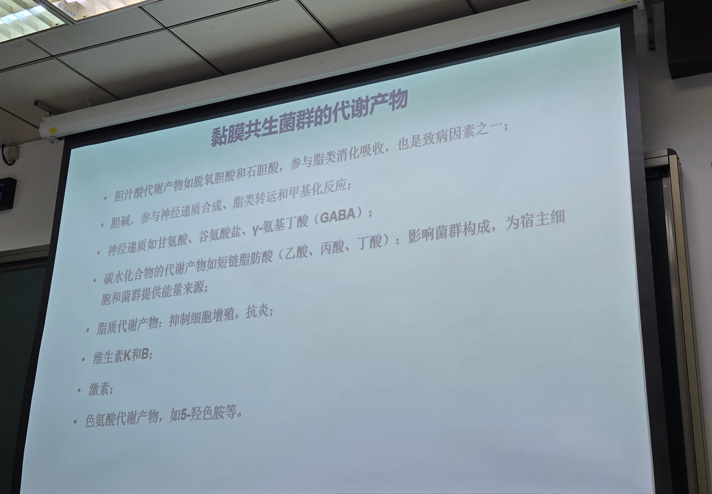
    
21. 健康人黏膜共生菌群作用：维持黏膜菌群结构的稳态，抑制病原菌生长繁殖；竞争黏附黏膜上皮细胞；促进黏液层形成，促进紧密连接形成，促进抗菌肽和防御素等分泌；促进黏膜免疫系统发育，促进肠道分泌型IgA产生；促进肠道神经系统发育；辅助消化、提供肠上皮以及机体所需营养
22. 无菌小鼠可用于研究菌群影响。研究发现，无菌鼠的消化道通过时间延长，肠道表面积小，肠绒毛细，固有层薄，隐窝浅，肠上皮通透性增加，肠上皮细胞和干细胞增殖降低，潘氏细胞减少，杯状细胞减少，肠道神经发育异常。说明菌群能够参与肠道的生长发育
23. 黏膜共生菌群的影响因素：环境因素、黏膜上皮和黏膜免疫的功能等
24. 不同黏膜部位之间的影响：
    
    
    
    
    
25. 菌群在肿瘤发生和治疗中的作用：如幽门螺杆菌和胃癌发生相关。在治疗中，无菌鼠、抗生素或粪菌移植处理后人/鼠的消化道相关肿瘤（结肠癌、胃癌、肝癌）和非消化道肿瘤（胰腺癌、肺癌、乳腺癌、眼附属器淋巴瘤）发生率降低，抗肿瘤能力增强。个体之间的菌群结构差异、器官/组织间菌群差异、同一组织不同部位的菌群差异与肿瘤发生差异密切相关
26. 生物被膜：细菌自身产生的胞外多糖、纤维蛋白质、脂蛋白等包裹着的多细胞群体结构。由多个微菌落和水通道组成，细菌细胞间相互协调作用，是潜在的“菌巢”。其异质性强，与浮游的细菌相比生长特性不同。结肠癌（尤其右侧结肠癌），与细菌生物被膜密切相关。肿瘤患者和健康人的肠道生物被膜都具有致癌性。因生物膜中的细菌以致病性菌为主。生物膜诱导IL-17+细胞和髓系细胞浸润。
27. 黏膜免疫部位菌群通过血管、淋巴管来进入瘤内，或通过感染的免疫细胞进入瘤内
28. M1巨噬细胞抗菌抗肿瘤，细菌增加MDSC，促进M2分化，促肿瘤发展与EMT；中性粒细胞的趋化因子和弹性蛋白酶可促进肿瘤发展
29. 菌群可产生抗原、PAMP、粘附因子、代谢产物、毒素等，可改变DNA损伤、氧化应激、Wnt/NF-κb/STAT3/MAPK等通路与免疫细胞表型的改变
30. 细菌毒素相关：
    
    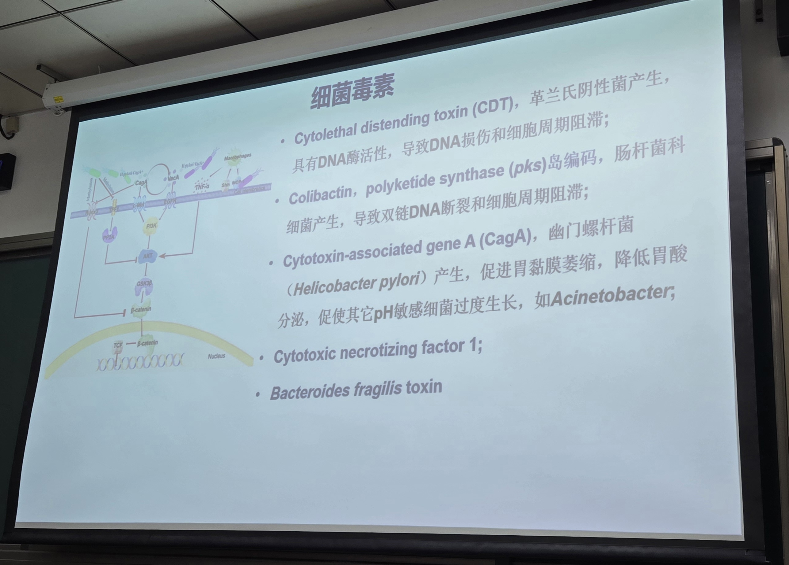
    
31. 短链脂肪酸主要促进Treg生成，产生局部免疫耐受。短链脂肪酸在盲肠和近端结肠浓度最高，为上皮细胞提供70%的能量（丁酸为主，β-氧化形成acetyl-CoA），调节细胞生长与分化（促进Treg分化与分泌IL-10。高剂量时促进CD8+ T细胞表达IFN-γ和颗粒酶B，促进记忆T细胞分化，抑制髓系细胞NF-κB活化和炎性介质产生）。乙酸和丙酸用于调控远端非黏膜组织；色氨酸可促进Treg生成，也可促进抗肿瘤免疫应答（T细胞上的芳香烃受体）产生；胆汁酸有肠肝循环（肝脏产生，95%回肠吸收）功能。胆汁酸可通过氧化应激促进DNA损伤，促进细胞凋亡抵抗和存活，下调肝血窦内皮细胞CXCL16，减少CXCL16+ NKT细胞募集和免疫监视，通过结合TLR2诱导肝星状细胞衰老，促进COX2-PGE2轴，抑制免疫
32. 20-30%的结肠癌与炎症密切相关，结肠癌中15%的死亡率与炎症性疾病有关。慢性炎症是结肠肿瘤的癌前病变（过程：TNF-α促进NK-κB活化，促进上皮细胞去分化和肿瘤发生，NF-κB持续活化促进IL-6和ROS产生，ROS诱导DNA损伤，IL-6-STAT3促进上皮细胞增殖、抑制凋亡、抑制抑癌miR-34a表达，促使EMT。而p53突变可直接或通过破坏粘膜屏障促进免疫细胞NK-κB的持续活化）。AOM致癌小鼠模型中给与DSS显著增加结肠癌发病率
33. 无菌鼠或抗生素处理小鼠的肿瘤浸润髓系细胞对化疗反应低下，ROS产生减少，抗肿瘤能力减弱
34. 菌群与远端肿瘤微环境：肠道菌群影响免疫细胞亚群分化、功能及其向肿瘤的迁移能力；菌群抗原与肿瘤抗原的相似与否；肠道菌群直接或间接通过树突状细胞进入肿瘤；肠道菌群的模式识别分子和菌群相关可溶性代谢产物
35. 瘤内菌则：可培养传代，使用抗生素可以抑制肿瘤生长；促进中性粒细胞聚集/滞留，活化应激相关激酶；抑制免疫原性细胞死亡，可被抗生素逆转；细胞骨架重塑，促进转移；促进IFN-γ+ 记忆性Th1细胞应答；促进三级淋巴结构生成，生成细菌特异性Tfh和IgG；免疫检查点抑制剂重塑肠系膜淋巴结，促进肠道DC携带免疫原性细菌进入肿瘤，诱导抗肿瘤应答

# 专题：T细胞介导的抗肿瘤免疫及肿瘤免疫治疗

---

### 10月16日

1. B7-CD28家族：
    
    
    
2. 大多肿瘤的化疗剂和放疗具有免疫抑制作用（损伤骨髓细胞），无论有无肿瘤淋巴结转移，手术往往进行引流淋巴结清扫，但肿瘤引流淋巴结是抗肿瘤免疫反应启动和发生的场所
3. 体内有癌细胞不是癌症患者，只有当癌细胞不受约束地生长，影响机体生理功能时，才成为癌症患者
4. 抗PD-1/L1优势：广谱抗肿瘤作用、对晚期肿瘤治疗有效、长期生存；劣势：癌种或适应症治疗的总体缓解率为21%、完全缓解率为10%，对大多数肿瘤患者无效 
5. 缺乏抗肿瘤T细胞是PD-1抗体药物治疗无效的根本原因：冷肿瘤、免疫抑制性肿瘤、免疫耗竭性肿瘤
6. 细胞因子与T细胞分化：
    
    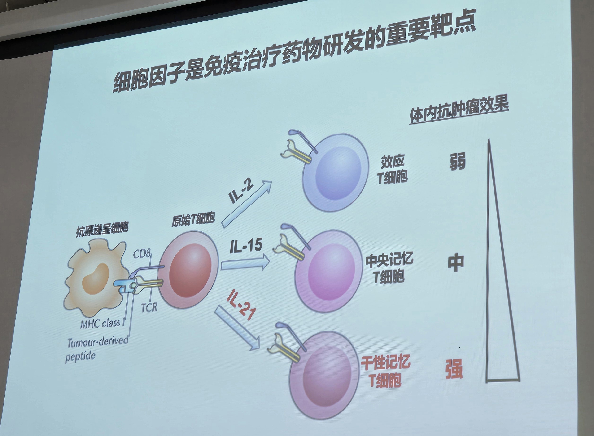
    
7. 赫赛汀与IL-21联合治疗无法显著提高抗肿瘤效果，但是赫赛汀-IL-21融合蛋白可以显著提高抗肿瘤效果（瘤内注射IL-21才有效果，赫赛汀用于靶向肿瘤）
8. 化疗药物没有选择性，实际上是清除体内增殖性高的细胞，而T细胞在增殖高峰是体内增殖最快的细胞类型，因此化疗+抗PD-1联合治疗的效果不明显

# 专题：肿瘤代谢

---

### 10月18日

1. 肿瘤细胞的代谢出现变化，进而能够影响浸润免疫细胞的代谢
2. 肿瘤代谢特征：对肿瘤进行定义，其即一群失去正常生长调控机制，发生恶性转化的自身细胞。肿瘤有缺氧、缺糖、高乳酸低pH、进行氨基酸消耗/谷氨酰胺代谢和脂代谢（获得磷脂）、具有高活性氧簇ROS或高活性氮簇RNS等特征
3. 缺氧：细胞增殖过快导致耗氧量激增，肿瘤组织体积膨胀过快导致血供不足。这会导致缺氧敏感分子HIF1α在多种细胞中迅速上调且稳定表达。HIF1α直接调控糖代谢、血管生成、细胞外基质生长等的基因
4. 巨噬细胞主要杀菌途径：双氧水，即氧依赖的途径。缺氧途径则诱生TAMs（M1巨噬细胞耗氧量大于M2巨噬细胞），M2巨噬细胞对氧需求量低
5. 乳酸诱生TAMs。TAMs与肿瘤细胞竞争营养物质（特别是葡萄糖），因此TAMs的葡萄糖代谢过程发生了与肿瘤细胞类似变化。TAMs具有高度活性的有氧糖酵解。乳酸可以激活TLR4/MyD88/TRIF信号通路，与TLR4结合后，激活TLR4-MyD88-TRIF信号抑制κB-α活性促进M2极化；可以激活PPARγ信号通路，促进M2巨噬细胞分化；乳酸参与组蛋白H3K18乳酸化修饰；可以促进M2巨噬细胞标志物表达，增加CD206、Arg1的mRNA表达；可以影响细胞形态（pH），乳酸处理的巨噬细胞表现出M2极化形态，如体积增大，明显突起伪足和偏锥形细胞比例增加；可以调节细胞因子水平，如降低TNF-α水平，增加IL-10水平
6. 其他代谢子也可以诱生TAMs。高谷氨酰胺代谢产物α-酮戊二酸（αKG）、谷氨酰胺酶（GLS）、谷氨酰胺合成酶（GS）促进M2巨噬细胞分化；高腺苷通过与巨噬细胞表面腺苷受体（A2AR）结合，促进M2巨噬细胞分化；L-精氨酸被大量竞争，无法生成NO，从而降低了分化为M1巨噬细胞的能力
7. M2巨噬细胞是与肿瘤细胞在代谢上最为相近的免疫细胞
8. TAM与肿瘤生长：TAM可表达多种刺激肿瘤细胞增殖和存活的细胞因子包括EGF上皮生长因子，PDGF血小板源性生长因子，TGF-β1，bFGF碱性成纤维细胞生长因子
9. TAM与肿瘤转移：TAM可以通过上调表达蛋白水解酶（如组织蛋白酶B）、MMPs基质金属蛋白酶、纤溶酶、uPA尿激酶及其受体等的表达，破坏基底膜，降解细胞外基质，从而促进肿瘤细胞向周围正常组织侵袭
10. MDSC是DC、巨噬细胞和/或粒细胞的前体，具有显著抑制免疫细胞应答的能力。在骨髓中尚未分化完全时，由于TNF-α
11. 缺氧条件下，通过HIT1-ENTPD2-ATP降解-MDSC分化行使抑制功能（肿瘤细胞、M2巨噬细胞、MDSC等可以上调表面CD73，使得胞外ATP向生成ADP/AMP过程移动，过程中腺苷上升，而腺苷是抑制性环境的重要因素）
12. 乳酸诱生MDSC：可以激活PI3K/AKT/mTOR信号通路，从而增加GLUT1表达，促进MDSC
13. 肿瘤微环境是高脂环境。巨噬细胞摄取递呈大量脂肪后，使得DC细胞内表面被屏蔽，通透性大幅降低，导致DC细胞表面MHC分子表达下降，从而使得T细胞无法接受抗原信号
14. naive T细胞代谢很低，主要利用三羧酸循环，活化后进行糖酵解过程。Th17（mTORC1、HIF）、Th1（mTORC1）、Th2（mTORC2）、CD8效应细胞（mTOR）走糖酵解途径，Treg（AMPK）下调三羧酸循环与糖酵解，升高脂代谢，CD8 记忆细胞（AMPK）也走脂代谢途径。不同的代谢途径会导致代谢产物不同，使得功能不一。
15. T细胞在糖代谢途径中的相关影响：
    
    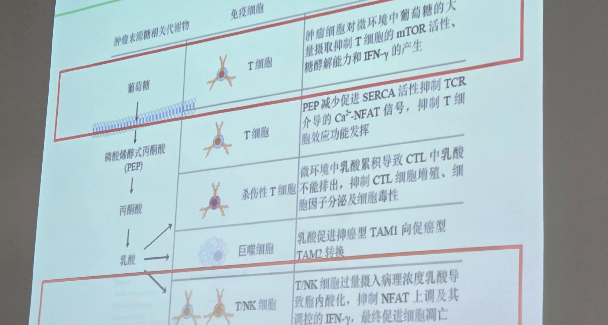
    
16. TIL长期处于炎症环境下，功能不足，缺氧缺血缺乏精氨酸，会导致增殖能力下降、活化状态下降、细胞因子产能下降、自我更新能力下降、抑制型受体上升、凋亡速率上升
17. Treg占CD4的5-10%，某些类型的肿瘤中50-80%，是唯一天然存在、行使抑制性功能的免疫细胞。正常状态下，Treg是自身免疫疾病的重要防治来源。厌氧条件下HIF1α的上调结合Foxp3相关酶，使得Foxp3相关酶无法降解Foxp3,上调Treg。同时，HIF1α可以抑制STAT3途径，防止分化成为Th17。
18. Treg可以生产腺苷、抢夺IL-2、分泌IL-10/35、上调PD-1。Treg与其他T细胞不同，可以直接摄入乳酸进行代谢
19. 高乳酸、高ROS诱生Treg：感染、组织损伤、缺血或干预引起的肿瘤细胞死亡能够造成局部胞外ATP水平急剧升高，升高的胞外ATP水平能够刺激巨噬细胞和DC的聚集，激活DC中的NLRP3并释放IL-1β。若胞外ROS含量过高，Treg能够刺激胞外核苷酸酶CD39和CD73对胞外ATP连续处理，使得胞外腺苷含量从较低的自我平衡状态（20—200nm）迅速提升到高达1000-10000nm的水平
20. 新型代谢药物：IDO，将色氨酸降解为犬尿氨酸，是DC特异的过程，改良DC性能（即针对某种细胞的某一种特定代谢功能）
21. 其他新型代谢药物：
    
    .jpg)
    

# 专题：模式识别受体、炎症小体与肿瘤

---

### 10月23日

1. 炎症产生的原因：理化因素、机械、生物等；类型：临床分型：超急性、急性、亚急性、慢性；病理分型：渗出性、变质性、增生性；根据引起炎症原因不同：有菌性炎症与无菌性（Sterlie）炎症
2. 慢性炎症病理变化特点：炎症灶内浸润细胞主要为巨噬细胞、淋巴细胞和浆细胞而非中性粒细胞；由炎症细胞造成的组织损坏。炎症性肠病与结肠肿瘤有关（模型：AMO+DSS）。炎症可促进许多肿瘤，特别是上皮炎症致肿瘤的方式，慢性炎症的作用尤为突出。慢性炎症的刺激导致肿瘤释放许多直接促进其自身生长的因子，构成一个炎性微环境，有利于肿瘤的发生发展
3. 肿瘤特征：
    
    
    
4. 感染与肿瘤发生：血吸虫感染可引起膀胱、肝和直肠癌以及脾的滤泡淋巴瘤；HPV与宫颈癌相关；HIV感染与淋巴瘤和卡波氏肉瘤有关；EB病毒感染和Burkitt淋巴瘤、鼻咽癌相关；细菌与胆石引起慢性胆囊炎引起胆囊癌等
5. COX-2、CCL2、TNF-α、IL6、IL1-α等细胞因子可介导炎症反应
6. 急慢性炎症与肿瘤发生的关系：
    
    
    
    
    
7. 非甾体抗炎药可以阻断并抑制COX代谢，阻止前列腺素的发生，阻碍肿瘤发生
8. PRR是固有免疫细胞表达的直接识别微生物或衰亡细胞所特有的多糖或其他模式分子的受体。模式识别理论认为某些病原体或其产物共有在进化上高度保守的特定分子结构，这种高度保守的分子结构即病原相关分子模式（PAMP）
9. 固有免疫系统的主要模式识别受体家族：TLRs、RLRs、NLRs、CLRs、ALRs。DNA病毒相关sensor有：cGAS、DAI、AIM2、IFI16等
10. Toll like receptors：进化保守，具有TIR结构域（与IL-1受体同源），可在细胞膜、内体溶酶体表达。经典二聚体有：膜表面的TLR1/TLR2、TLR2/TLR6、TLR4（脂多糖）、TLR5、TLR11；胞内的TLR3（双链RNA病毒）TLR7、TLR8（单链RNA病毒）与TLR9（CpG DNA）
11. TLR信号在肿瘤中具有抗肿瘤（在免疫细胞表达，可能为抗肿瘤作用）或促肿瘤（若在肿瘤细胞表面表达，一般认为促肿瘤）的作用
12. TLR激动剂（可充当佐剂在免疫中起作用）可能促进抗肿瘤免疫。卡介苗细胞壁股价通过TLR2和TLR4发挥抗肿瘤作用；dsRNA激活DC细胞表达的TLR3，刺激干扰素产生，诱导细胞凋亡等
13. 细胞质PRRs(NLRs)可分NLRA、NLRB、NLRC、NLRP等家族成员，可能参与炎症小体组装。NOD1识别革兰氏阴性菌的肽聚糖meso-DAP；NOD2识别细胞内的MDP、革兰氏阳性阴性菌。Nod2缺陷或突变的小鼠或病人均有肠道的生态失衡，在小鼠其基因缺陷与结肠癌的发生有关。NOD1促进乳腺癌细胞凋亡
14. RLR相关通路：RIG-I-MAV通路
15. cGAS-STING通路：cGAMP与CDN作为第二信使可以激活该通路，可用于肿瘤免疫治疗；该通路也可以促进CTL的homing，促进抗肿瘤。但若STING通路持续活化，导致慢性炎症发生，则会有促肿瘤作用
    
    
    
16. PRR识别PAMP时，介导有菌性炎症；识别DAMPs时，介导无菌性炎症，此时，DAMP不仅可被经典PRRs识别，也可被Non-PRR受体识别（RAGE、TREM、GPCRs、iron channels等）
17. PAMP：某些病原体或其产物共有的高度保守的分子结构，如微生物体内的特征性蛋白、由微生物合成的脂质复合物和碳水化合物、微生物特异的核苷酸与凋亡细胞表面的磷脂酰丝氨酸（凋亡细胞磷脂酰丝氨酸外翻）等
18. DAMP：在损伤、应激、细胞死亡时，细胞内的内容物（蛋白（核：HMGB1histoneCIRP；胞质：S100HSPs；线粒体：TFAM等）、ATP、DNA、RNA、Uric acid等）释放出来/细胞核或细胞质蛋白、核酸等，在细胞死亡、应激、损伤、凋亡、坏死后释放到细胞外，这些分子即DAMPs，这些分子的本意时警示免疫系统对组织损伤有反应，启动组织修复等。缺血再灌注损伤、晶体诱导的关节炎、创伤及慢性疾病如肿瘤、动脉粥样硬化、自身免疫病时均有无菌性炎症发生。许多炎症性疾病的血清中均可检测到。DAMP是一类警戒素
    
    
    
19. DAMPs活化TLR信号通路以及炎症小体：
    
    
    
20. Loss of intracelluar DAMPs会导致基因组不稳定，便可能促进肿瘤发生
21. HMGB1是非组蛋白核蛋白，正常情况下，其结合DNA促进基因转录；应激情况下，HMGB1是从坏死/凋亡细胞中被动释放出来，也可被免疫或非免疫细胞主动分泌；其本身几乎没有促炎作用，但可以与促炎因子结合发挥促炎作用。已知的受体：TLR2（Pam3CSK4/Nucleosome）、TLR4（结合LPS/C106 reduced）、RAGE（直接被膜表达物识别） 、TLR3/7/9（结合核酸，进入胞内并被胞内受体识别）、IL-1RI（结合IL-1α/β）etc.，
22. 总的HMGB1常在肿瘤高表达，细胞核HMGB1在一些肿瘤内低表达。HMGB1是肿瘤抑制子，可增强Rb活性，诱导Rb依赖的G1阻滞和细胞凋亡。细胞核HMGB1丢失导致基因组不稳定和端粒缩短
23. DAMP治疗手段：阻止DAMP释放（如抗凋亡治疗）、中和或阻断胞外DAMPs、阻断DAMP受体或信号通路、靶向HMGB1
24. 炎症小体：NLR家族的NLRP1可与其它蛋白装配，并寡聚化，激活Caspase-1级联反应（经典通路）或Caspase-11（小鼠）/Caspase4 or 5（人）（非经典通路），切割Pro-IL-1β和Pro-IL-18，最终产生炎性细胞因子IL-1β和IL-18。同时导致细胞穿孔，引发细胞焦亡。组成成分：Sensor、Adaptor、Effector
25. 炎症小体促肿瘤：IL-1β促进MYC通路导致细胞增殖，IL-18促进免疫细胞凋亡，HMGB1促进免疫细胞PD-1上调等。当然，炎症小体也可促进免疫细胞抗肿瘤
26. 免疫原性细胞死亡（ICD）特点：抗原性：垂死的细胞表达不完全被胸腺耐受性所覆盖的抗原，体内存在识别这种抗原的T细胞克隆；佐剂性：免疫原性细胞死亡释放DAMP可被模式识别受体识别，诱导APC细胞激活、分化、成熟。促进I型干扰素/趋化因子的释放，促进APC和T细胞招募，进一步激活免疫。参与ICD的DAMPs有：CRT钙网蛋白、分泌性ATP、HMGB1、ANXA1
27. ICD诱导剂：
    
    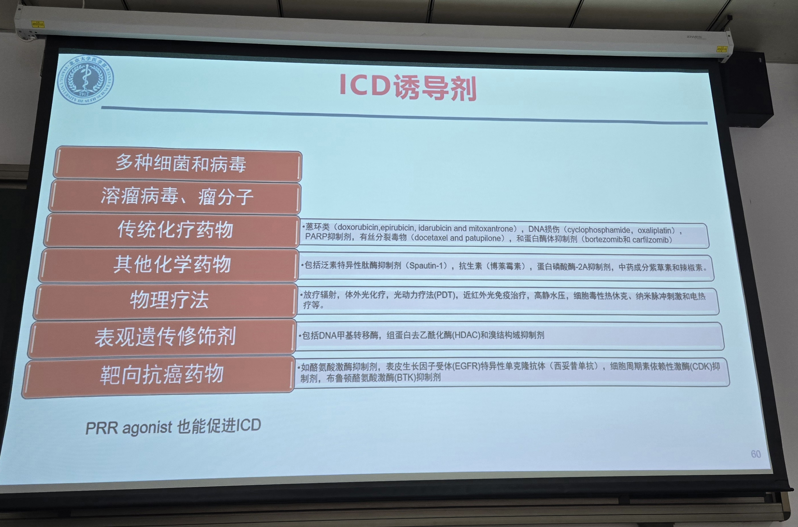
    
28. 免疫原性诱导可分I型和II型，区别在于是否为内质网应激
29. 肿瘤免疫逃逸的一种机制：RCD缺陷或释放DAMP缺陷等
30. PRR在不同免疫细胞或肿瘤细胞中可发挥抗肿瘤或促肿瘤的作用；PRR agonist可促进肿瘤细胞的ICD，促进DAMP释放；也可以与其他免疫治疗手段如ICB进行联合治疗等

# 专题：免疫细胞的内质网应激和自噬与肿瘤

---

### 10月25日

1. 自噬是所有真核生物中一种受严格调控和应激诱导的分解代谢途径；自噬过程：形成双层膜囊泡（成为自噬体，LC3-II可作为全过程的marker，P62在自噬体形成延长时表达量增多，自噬体成熟时减少），吞噬细胞靶点，降解，清除
2. 典型的自噬通常在细胞经历能量危机时诱导；自噬诱导信号（如营养剥夺）促发AMPK激活，同时抑制mTOR并激活启动前复合物（ULK1、ATG13、FIP200）。该复合物反过来磷酸化自噬起始复合物中的成分；ATG3、ATG16L1、ATG5-ATG12缀合物的复合体一起作为E3联盟；产生的自噬体融合到溶酶体（形成自噬溶酶体），导致LC3结合蛋白负载的自噬体内容物的消化
3. 自噬过程中的关键分子：
    
    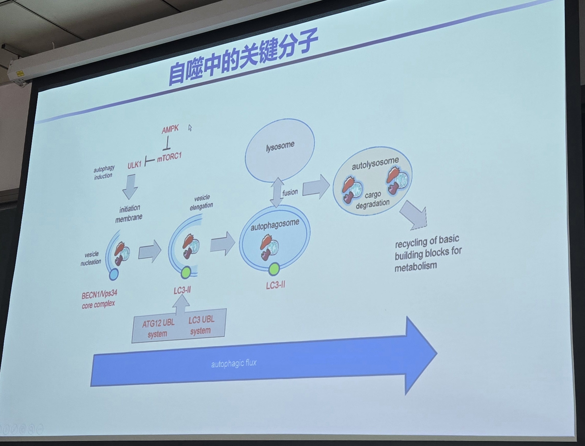
    
4. 自噬溶酶体和吞噬溶酶体区别：自噬双层膜结构包裹部分胞质、需要降解的细胞器、蛋白质等形成自噬体，并于内涵体形成自噬内涵体，最后于溶酶体融合形成自溶酶体，降解其内容物，保持细胞稳态和促进细胞器的更新；而在吞噬作用期间，单层膜的吞噬体和溶酶体融合形成吞噬溶酶体。吞噬溶酶体的形成，是在没有自噬的情况下发生
5. 哺乳动物细胞中选择性自噬形式：线粒体吞噬：通过自噬选择性降解受损和老化的线粒体，线粒体内膜上的电势损失会触发线粒体吞噬；内质网吞噬：自噬机制通过溶酶体对内质网成分和膜的选择性清除和降解；其他形式的选择性自噬：如铁蛋白噬菌体，通过NCOA4选择性将铁蛋白降解为正常的铁稳态
6. TME诱导肿瘤细胞自噬：
    
    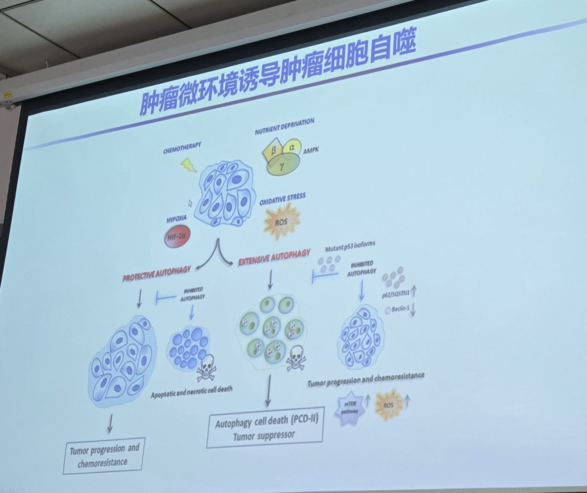
    
7. TME诱导肿瘤细胞自噬的条件：TME在癌症进展、转移和治疗抵抗中起关键作用；在TME中，肿瘤细胞中的自噬可由整合的细胞内和细胞外应激信号诱导，包括代谢应激、缺氧、氧化还原应激和免疫信号
8. TME中代谢应激引起自噬：TME的营养摄取不足会影响代谢机制，导致细胞内代谢应激；作为对代谢应激的反应，肿瘤细胞通过上调营养转运蛋白和激活自噬重新连接自身的代谢途径；代谢应激活化AMPK，mTORC1的活性降低；AMPK激活FoxO3和TFEB以放大自噬相关基因表达
9. TME中缺氧应激引起自噬：缺氧会抑制线粒体中的氧化磷酸化，增加AMP与ATP的比值，激活AMPK；AMPK靶向ULK1、Beclin1和mTORC1以诱导自噬；HIF1α转移到细胞核中，并诱导下游靶基因的表达，使Beclin1与BCL2分离，从而激活自噬；ATF4激活导致LC3B和ATG5表达上调，并维持高水平的自噬通量。这些事件促进了缺氧条件下自噬介导的肿瘤细胞存活
10. TME中氧化应激引起自噬：过多的ROS可能增加DNA损伤风险并促进肿瘤发生；氧化应激可以通过NF-κB介导的p62/SQSTM1上调来促进自噬；氧化应激还可以介导受损和功能失调线粒体的选择性降解（线粒体吞噬）。通过控制氧化应激，自噬可以抑制肿瘤发生，但也可以促进肿瘤细胞存活
11. TME中免疫信号引起自噬：DAMPs和细胞因子是调节自噬反应的主要可溶性介质；细胞外DAMP激活先天免疫细胞并促进炎症，这些信号被细胞外或细胞内模式识别受体如TLR、AGER、P2RX7受体识别，它们被认为是自噬诱导物；细胞因子以环境依赖的方式调节自噬途径，TGFβ激活自噬以增强其生长抑制作用，并延缓体外培养的人肝细胞和乳腺癌细胞的凋亡。在炎症相关胃癌模型中，IFNγ诱导的自噬与抑制致癌相关
12. 自噬对TME的影响：应激可调节细胞中的自噬途径，从而抑制或促进肿瘤进展；环境通过多种渠道影响肿瘤自噬，包括可变的肿瘤遗传学和分期以及宿主因素；自噬途径参与了免疫细胞亚群的存活和凋亡、分化、激活、效应器功能和肿瘤运输
13. 肿瘤自噬对免疫的影响：缺氧通过HIF1α诱导肿瘤细胞自噬。升高的自噬介导肿瘤细胞中颗粒酶B的降解（颗粒酶B由活化的CD8+T细胞和NK细胞分泌），并阻断CTL介导和NK细胞介导的肿瘤杀伤；自噬抑制趋化因子CCL5的表达，这会促进NK细胞迁移至TME；对于DC细胞，死亡肿瘤细胞中的自噬通过增加自噬体与肿瘤抗原的产生，促进DC细胞介导的交叉呈递；BRCA1基因蛋白（NBR1）的邻居通过自噬途径介导MHC I类降解，并消除细胞毒性T细胞识别，肿瘤自主自噬在肿瘤抗原呈递中的作用是环境依赖性的；对于NK与CD8+T细胞，低氧诱导的肿瘤细胞自噬能降解NK细胞分泌颗粒酶B，从而减缓肿瘤溶解，达到促进肿瘤的作用。缺氧诱导的肿瘤自噬能促进肿瘤细胞STAT3磷酸化，并使肿瘤细胞对CTL介导的杀伤失去敏感性，减弱NK细胞和CTL的抗肿瘤功能，而激活的肿瘤自噬可能是TME中的癌细胞固有免疫机制；对于T细胞而言，肿瘤浸润T细胞表现出受影响的自噬，从而支持肿瘤免疫逃避，适当水平的自噬对CD8+T细胞的存活、分化和功能很重要。自噬导致CD8+T细胞中Bcl10降解，保护细胞免受NK-κB过度活化的不良后果。效应CD4+T细胞的自噬促进IL-2和IFNγ的表达。自噬可以调节T细胞代谢以控制T细胞表型，平衡的自噬途径塑造T细胞免疫并改变肿瘤免疫反应。在稳定状态下，幼稚T细胞主要依赖于氧化磷酸化。在抗原刺激下，T细胞经历从氧化磷酸化到糖酵解的代谢转变，以支持细胞增殖和效应器功能。在记忆形成期间，效应T细胞恢复到氧化磷酸化
14. 内质网：内质网是一个复杂的管状膜网络，只存在于真核细胞的细胞质中，除了精细胞和红细胞外，所有类型真核细胞都有内质网，这些膜形成连续的褶皱，呈囊状结构，最终连接核膜的外层。分粗面（片/囊状）和光面（管状）内质网
15. 内质网应激的传感与反应——未折叠蛋白反应的典型作用：在蛋白质平衡条件下，分子伴侣BiP（也称为GRP78）与内质网应激传感器结合，并保持它们处于非活性状态。在内质网应激期间，BiP对错误折叠或未折叠蛋白质表现出较高的亲和力结合，因此与传感器分离。这一事件使其激活并随后诱导未折叠蛋白反应UPR（也称为ER应激反应）。ER应激是一种适应性机制，能够通过包括转录重编程和mRNA衰变、整体翻译衰减，利用内质网相关蛋白降解（ERAD）系统去除错误折叠的蛋白质，通过诱导自噬回收错误折叠的蛋白和细胞材料
16. 内质网应激：表现为内质网腔内错误折叠与未折叠蛋白聚集以及钙离子平衡紊乱。可激活未折叠蛋白反应（UPR）、内质网超负荷反应和caspase-12介导的凋亡通路等信号途径。既能诱导糖调节蛋白GRP78、GRP94等内质网分子伴侣表达而产生保护效应，亦能独立诱导细胞凋亡
17. 内质网应激传感器：ATF6、IRE1α、PERK。通路为：
    
    
    
18. 相关通路简介：ATF6通路在ER stress时，会易位到高尔基体，被S1P和S2P蛋白酶裂解，释放ATF6 p50（起转录因子作用）。ATF6 p50与XBP1形成异二聚体，并介导XBP1转录物和其他参与内质网蛋白质折叠和降解的基因的诱导；IRE1α通路是UPR进化上最保守的通路。应激条件下IRE1α活化后，能够特异性地剪接XBP1的mRNA、形成有活性的转录因子。在被激活后，IRE1β寡聚并进行自动磷酸化引起构象变化，激活其RNase结构域，此时细胞质中的XBP1 mRNA中会切除26个核苷酸片段，产生一种修饰的mRNA亚型（XBP1s），编码强效转录因子XBP1。在IRE1α通路活化后，能诱导编码伴侣蛋白、折叠酶和内质网相关蛋白降解成分的基因，控制脂质和己糖生物合成。而在特定条件下，IRE1β的RNase结构域也可以在称为调节IRE1依赖性衰变（RIDD）的过程中降解某些mRNA。IRE1α通过与不同的衔接蛋白和调节剂蛋白相互作用，可进一步激活JNK、p38和NK-κB通路，从而调节炎症、自噬和凋亡；PERK通过增加抗氧化剂谷胱甘肽的生物合成来控制氧化应激，由此产生的蛋白质折叠能力的增加将有利于肿瘤生长。PERK-eIF2α轴减弱整体翻译并增强自噬，以促进MYC驱动的淋巴瘤中的细胞保护性UPR功能。PERK通过多种机制调节脂质代谢和磷脂生物学，其驱动的非编码RNA调控对促进癌细胞存活至关重要
19. 肿瘤诱导内质网应激反应：肿瘤微环境的特征是高代谢需求、缺氧、营养限制和酸中毒，这些环境会影响细胞的钙和脂质稳态。TME的改变会影响内质网的蛋白质折叠能力，从而促进错误折叠或未折叠蛋白质的积累，导致内质网应激。癌细胞中的致癌事件通过提高全面转录和翻译速率进一步促进这种状态。UPR随后会被激活，以试图恢复ER稳态并促进对肿瘤中不同损伤的适应。某些治疗方式也可触发癌细胞中的ER应激，以改变其在TME中的正常行为
20. 引发内质网应激的因素：缺氧是TME的常见特征，扰乱内质网内稳态并诱导应激，翻译后折叠或异构化是依赖氧气的过程。缺氧限制了氧依赖性内质网局部氧化还原酶ERO1α的功能，这是形成二硫键和蛋白质折叠所必需的，氧也是脂质去饱和所必需的；营养素可用性也会影响内质网应激的产生。代谢应激的特点是营养供应不足或过量，很容易破坏内质网内稳态。葡萄糖或谷氨酰胺的缺乏中断了己糖胺生物合成途径，它是ER中蛋白质折叠所需的能量来源和磷酸盐供体。氨基酸可用性不足是TME的另一个关键应激源，氨基酸饥饿激活激酶GCN2诱导eIF2α磷酸化。肥胖通常与较高的癌症风险相关，高脂肪饮食中富含的饱和长链脂肪酸导致内质网膜的大小、组成和流动性发生变化，最终导致内质网膜应激；ROS积累同样能够引发内质网应激。内质网中的蛋白质折叠严重依赖于该细胞器的氧化还原状态，细胞内ROS积累可严重扰乱内质网蛋白质组装，其可通过改变内质网内钙通道和促进脂质过氧化副产物的生成，从而引发蛋白质折叠应激。ROS的过度产生促使PERK介导的NRF2稳定
21. 细胞内质网应激的程度影响细胞命运：
    
    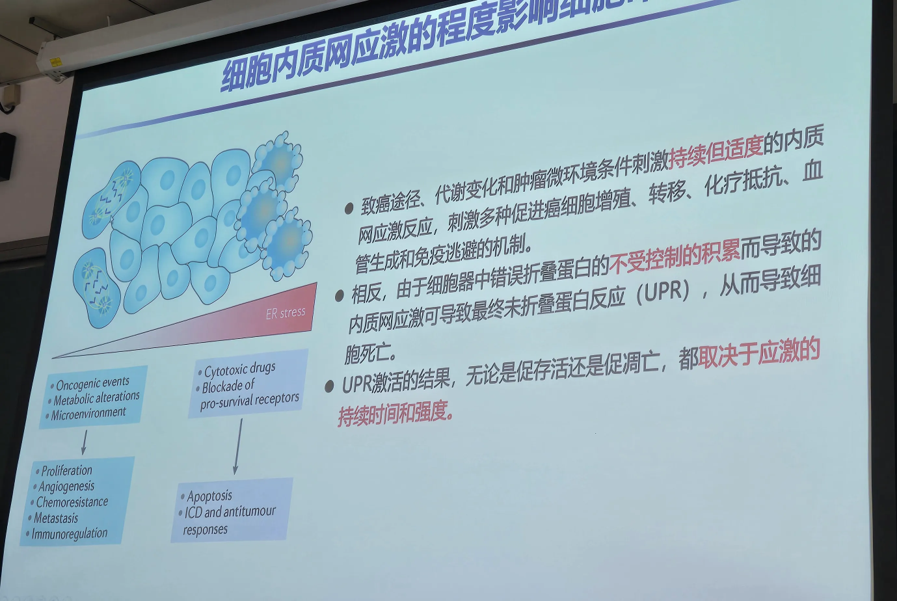
    
22. 内质网应激与转录因子：癌基因MYC通过多种机制激活未折叠蛋白反应，MYC诱导的全面转录和翻译上调增加了内质网中核糖体的生物合成和蛋白质负荷，从而激活UPR所有分支，MYC结合到IRF1α基因的启动子和增强子区域，增加IRF1β蛋白水平，MYC-XBP1s形成异二聚体，以调节经典的UPR基因和脂质代谢基因，MYC参与与PERK、ATF4相互作用，调节氨基酸转运蛋白和生物合成、抗氧化途径和自噬，mTORC1激活可诱导蛋白质合成和内质网超负荷，从而激活UPR；RAS同样会参与内质网应激反应。突变HRAS优先诱导角质形成细胞中的IRE1α活性，HRAS-G12V-PI3K增加ER含量并诱导所有UPR分支的激活。HRAS-G12V还能够触发IRE1α和ATF6激活，以抑制肿瘤生长。但目前尚不清楚突变体RAS是否能增强ER中的整体蛋白翻译和蛋白负荷，从而促进所有癌症类型的ER应激
23. IRE1α-XBP1信号参与肿瘤进展：IRE1α-XBP1信号传导增强了HRAS诱导的角质形成细胞增殖——IRE1β是突变KRAS45的合成致死伴侣。致癌转化后，IRE1α和PERK可激活协调癌细胞非致死性内质网应激反应，促进癌细胞适应和肿瘤生长。IRE1α-XBP1信号促进了经典UPR基因的表达，促进错误折叠蛋白质的降解，同时增强蛋白质折叠和分泌，维持UPR的细胞保护功能。XBP1通过与HIF1α形成异二聚体并控制关键调节因子（包括葡萄糖转运蛋白1和乳酸脱氢酶a）的表达来调节低氧反应和糖酵解。XBP1还能够通过转录诱导关键酶来控制脂质代谢
24. ER stress对细胞的作用：MDSC中TRAIL-R的表达促进ER应激诱导的炎症或凋亡反应，IRE1α-XBP1促进LOX1上调，LOX1可对T细胞产生高度抑制作用。MDSC中PERK-CHOP的主要免疫调节和致瘤功能。ROS和过氧亚硝酸盐在肿瘤相关的MDSC中驱动ATF4从而诱导MDSC，促进对T细胞的抑制。PERK激活，会促进MDSC中NRF2信号传导，抑制STING依赖性I性干扰素产生，从而抑制能够增强免疫检查点阻断和过继性T细胞免疫治疗效果的抗肿瘤免疫应答；对于巨噬细胞，富含TME的细胞因子如IL-4、IL-6和IL-10，会通过激活STAT3和STAT6，在巨噬细胞中触发IRE1α-XBP1信号传导，促进巨噬细胞介导的癌细胞侵袭的ECM降解组织蛋白酶的表达和分泌。内质网应激还通过CD36摄取氧化低密度脂蛋白（ox-LDL）导致巨噬细胞内质网应激，IRE1α和ATF6激活会促进细胞内脂质积累。但值得注意的是，载脂巨噬细胞促肿瘤生长的免疫抑制能力是否由ER应激介导仍不清楚。此外，TAM中的IRE1α-XBP1强烈激活会促使PDL1和精氨酸酶1的表达——这是因为IRE1α依赖性基因特征可能与CD274（PD-L1）的表达情况有关。IRE1β能够显著提高荷瘤小鼠的存活率；对于DC，功能失调的肿瘤相关DC表现出细胞内ROS的积累，通过产生脂质过氧化副产物来改变ER驻留蛋白，从而引发ER应激和持续激活UPR。这些肿瘤相关DC中持续的IRE1α-XBP1激活不仅上调了多种UPR因子，而且诱导了驱动甘油三酯生物合成和脂质滴形成途径的转录激活，异常的脂质积累和不受控制的脂滴形成最终阻碍了它们的抗原递呈能力；IRE1α-XBP1信号还控制关键免疫抑制因子的表达，抑制肿瘤内T细胞浸润。TME引发不适应的ER应激反应，从而控制肿瘤内T细胞的代谢适应度和效应器分布。此时T细胞显示出高强度的XBP1剪接和ER应激反应基因标记物的上调，这与肿瘤内T细胞浸润减少和IFN-γ表达减少有关

# 专题：抗体药物治疗

---

### 10月28日

1. Ig基因重排：Ig的V、D、J基因片段在胚系基因中成簇存在，要编码完整的功能性的Ig多肽链必须使这些基因中的部分片段重新组合，该过程称为重排
2. Ig基因可变区重排的两个必要条件：具有重组信号序列（RSS）。RSS由七聚体、九聚体及二者间的间隔序列组成，其在各基因片段两侧存在；具有重组活化酶。重组活化酶由重组活化基因（RAG）编码，有RAG-1/2两种。RAG出现在B细胞发育早期
3. 抗体分子多样性：
    
    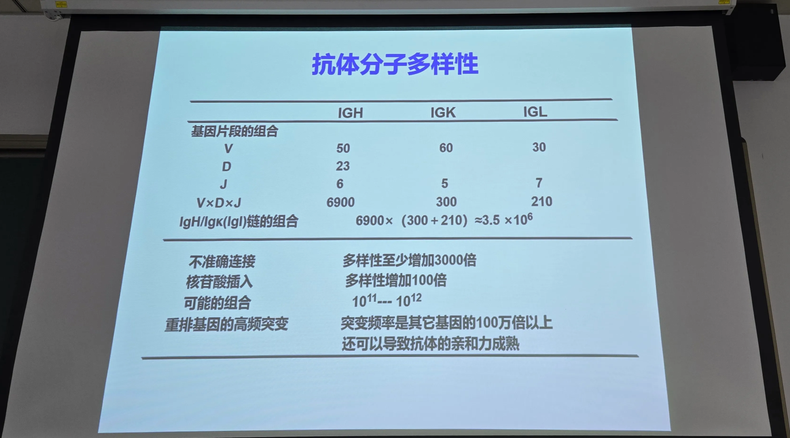
    
4. 抗体的生物学功能：中和毒素、炎症因子；介导溶解病原微生物或淋巴细胞；作为靶向性载体。通过中和作用、活化补体、ADCC、调理作用、胎盘被动免疫实现
5. 抗体药物与靶抗原的结合具有高特异性，有效性与安全性高
6. 抗体技术的三个阶段：第一阶段：多克隆抗血清。多克隆抗体（pAb）为由多个B细胞克隆产生的、受多种抗原决定簇刺激并可针对多种抗原表位的抗体混合物，主要用于一些感染性疾病的早期被动免疫治疗；第二阶段：细胞工程抗体。单克隆抗体（McAb）由一个B细胞克隆产生的、只作用于单一抗原表位的高度特异性抗体（杂交瘤技术）；第三阶段：基因工程抗体，与DNA重组技术相关，利用重组DNA及蛋白质工程技术对编码抗体的基因按不同需要进行加工改造和重新装配，经转染适当的受体细胞所表达的抗体分子。有嵌合（在基因水平上将小鼠Ig可变区和人的Ig恒定区嵌合在一起，人Ig分子的序列占70-80%，减少了单克隆抗体的免疫原性）、人源化（将针对某种抗原的鼠源特异性抗体的CDR基因代替人的Ig的CDR基因，所产生的抗体几乎为人源的，约90%）、完全人源化抗体等
7. 单克隆抗体的优缺点：小鼠单抗药物的Fc段无法被人免疫系统识别而产生效应；异源蛋白在人体内可能会产生网络效应，从而效果被中和
    
    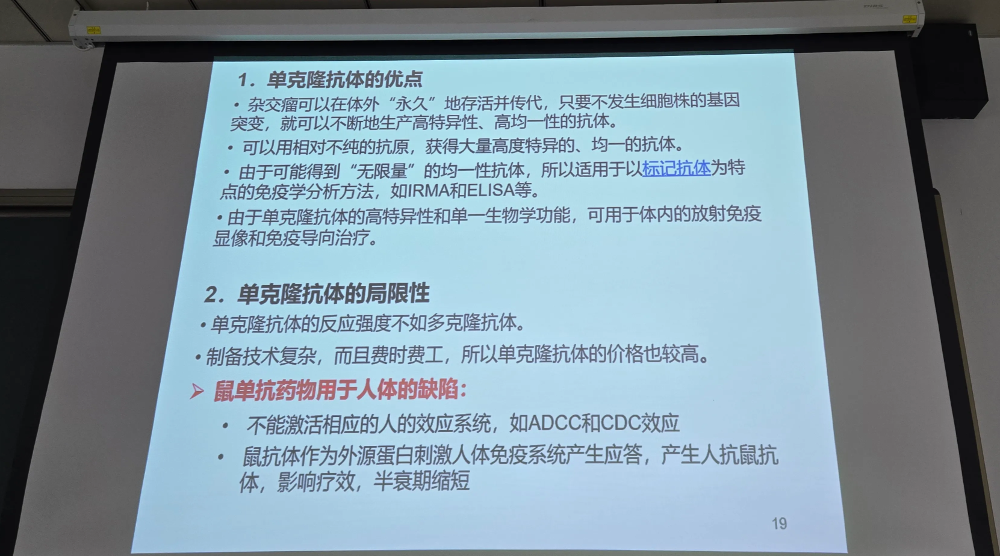
    
8. 基因工程抗体的种类：Half antibody、单链Fab’、F(ab’)2、Fab、ScFv、Nanobody、Diabody、双特异性抗体等
9. 通过基因重组改良抗体性能：人源化抗体（降低抗原性）、小分子抗体（穿透力强）、双价或双特异性抗体（增强抗体亲和力及效-靶细胞相互作用）、抗体融合蛋白（增加蛋白半衰期，与药物、毒性分子或酶基因融和表达，可用于肿瘤等疾病治疗）、细胞内抗体（用于胞内治疗或信号转导研究）。以TNFR-IgG1为例：
    
    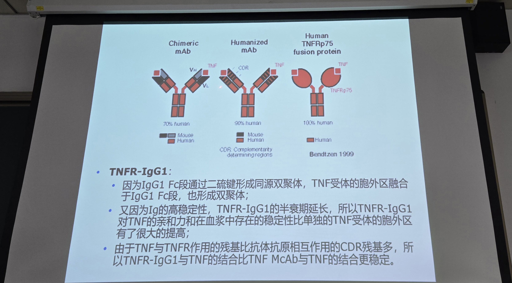
    
10. 纳米抗体：羊驼外周血液中存在一种天然缺失轻链的抗体，只包含一个重链可变区（VHH）和CH2和CH3区；不同于单链抗体片段那样容易相互粘连，甚至聚集成块
11. 基因工程抗体制备技术：RT-PCR或合成以克隆全套抗体可变区基因；Ig基因合成及噬菌体展示抗体库技术；分子建模；抗体基因片段在哺乳动物细胞的功能性表达；人源化小鼠
12. 根据针对的分子类型，抗体有：抗细胞表面分子的单抗、抗细胞因子的单抗、抗体导向药物。对于抗细胞表面分子的单抗，如抗CD3单抗，通过细胞清除、功能性受体封阻，杀伤成熟T细胞或阻断机体细胞免疫反应达到抗排斥目的。还有抗CD20嵌合抗体治疗B细胞淋巴瘤、抗CD33治疗急性髓系白血病等；对于抗细胞因子的单抗，有抗TNFα、IL2、VEGF的单抗药物；抗体导向药物是抗体作为导向载体，毒素、药物、放射性毒素、酶为弹头的药物（放射免疫疗法、抗体导向化学疗法、免疫毒素疗法）
13. 抗体药物的作用机制：靶点封闭作用（封闭靶抗原的功能表位，阻断其效应）；阻断信号转导（结合靶抗原，阻断下游信号通路，终止生物学效应）；靶向载体效应（交联化学药物或同位素，发挥靶向杀伤作用）；免疫应答（抗体本身具有的ADCC效应杀伤靶细胞）；免疫调节（与T细胞表面分子结合，阻断其功能）；免疫检查点（封闭免疫检查点，解除免疫细胞抑制作用）
14. IgG类型：IgG1含量最多，功能最强；IgG2倾向于和抑制型受体结合，下分IgG2a/2b；IgG3激活补体的能力最强；IgG4不能激活补体
15. 在肿瘤免疫治疗中，抗体起到举足轻重的作用。按分子结构可分为：单体IgG、抗体药物偶联物（ADC）、双特异性抗体、Fc融合蛋白、放射性Ig、抗体片段等。抗体具有：单独抗体分子作用，即中和效应，CDC、ADCC及ADCP效应；封闭或诱导胞内信号，抑制肿瘤细胞的增殖或诱导肿瘤细胞凋亡；可作为抗体偶联物（ADC），或与放化疗药物联用；用于抗体治疗联合细胞治疗，如CAR-T疗法（重塑T细胞）、联合其他免疫细胞治疗等；或通过影响其他效应途径，间接抑制肿瘤细胞。某些针对淋巴细胞活化或抑制调节途径所设计的抗体，可以间接增强肿瘤免疫，抑制肿瘤

# 专题：肿瘤免疫生物信息学分析

---

### 10月30日

1. 针对基因变异的药物：ALK重排——克唑替尼；HER2突变——曲妥珠单抗、阿法替尼；MET扩增——克唑替尼；ROS1基因融合——克唑替尼；BRAF突变——维罗非尼、达拉非尼；RET基因融合——卡博替尼；EGFR突变——厄洛替尼、吉非替尼、阿法替尼
2. Bulk相关数据库：TCGA、GEO、ArrayExpress、GSA等；Single Cell相关数据库：GEO、ArrayExpress、GSA及各类单细胞数据库。其中TCGA（The Cancer Genome Atlas）是目前最大的肿瘤基因信息资源库，涉及三十多种肿瘤类型、有超万份癌症组织及其配对癌旁组织的不同分子层次的组学测定数据
3. CCLE：癌细胞系数据库
4. 癌症细胞在基因变异的基础上产生的带有特异性氨基酸序列变异的蛋白即neoantigen
5. Mutation: Minor Allele Frequency(MAF)≤1%; Polymorphism(多态性): MAF>1%
6. HLA、TCR、BCR在机体中的基因多态性最强
7. KRAS G12D为其常见突变，在消化道肿瘤高发。KRAS G12D突变能够产生与HLA-C*08:02高亲和力结合的新抗原，从而可被T细胞识别
8. 免疫浸润：CIBERSORT、xCell
9. 免疫组库数据库：IMGT
10. 免疫组库常规分析项目：V、J基因使用频率；VJ组合的使用频率；CDR3氨基酸长度分布；20种氨基酸的使用频率；免疫组库CD3多样性指数（香农指数、辛普森指数、玛格列夫指数、贝格-派克指数等）；CDR3氨基酸保守性分析；样本间比较等

# 专题：DNA损伤修复

---

### 11月1日（进展课）

1. 抑癌基因突变（TP53、BRCA1/2等）会导致肿瘤发生
2. DNA损伤来源：外源性因素如放射线、化学物质、病毒感染等；内源性因素如氧自由基、醛类物质代谢（醛类可以使得DNA链间/内交联）、复制压力（DNA链打开、一条链复制为两条链时容易出现DNA损伤）
3. 修复方式：proofreading（最原始的修复方式，为DNA聚合酶的一种活性，切除错误碱基再插入正确碱基，3’-5’外切酶活性可使得聚合酶具有高保真性。proofreading位于聚合酶的Exonuclease部位，外翻错误碱基部位切除，再翻转回聚合酶功能域进行插入）、DR（直接修复，主要用于去除错误的碱基修饰。在此过程中，有感知蛋白、介导蛋白、修复蛋白参与。特点：直接、迅速、不需要切割DNA链、不易出错）、MMR（错配修复。Mut S: recognize mismatch、Mut L: mediator, activate Mut H、Mut H: recognize GATC, link, 内切酶功能；大肠杆菌的hemi-methylated：新合成的链在10分钟内GATC没有甲基化修饰，以此区分新旧链。在真核细胞中没有Mut S/L/H，但存在其同源物。如Mut S的同源物为Msh2/Msh6；真核细胞中，区分新旧链通过replication-generated nicks判断，即通过是否有DNA链末端来判断）、BER（碱基切除修复，出现alkylation、oxidative lesions、deoxyurail等时适用。DNA糖苷酶识别切除错误碱基，产生AP site，有filpping out现象，AP endonuclease切除链，产生缺口，再由DNA聚合酶插入、DNA连接酶连接）、NER（核苷酸切除修复，其损伤为bulky lesion，能够与转录相连。过程为：感知、切割、合成、连接。该过程与CSA、CSB等，XPA、XPB等的基因家族相关）、NHEJ（NHEJ/MMEJ/SSA（不同长度）非同源末端连接，直接将断裂的DNA端快速连接，会造成遗传信息丢失与基因异常。相关酶：Ku70/80，~25 bp Ku dimer，识别断裂DNA末端，招募DNA-PK；DNA-PK，kinase；Artemis：nuclease；DNA poly；Ligase IV。NHEJ与VDJ重排相关。NHEJ组分的基因突变会导致不同疾病——DNA-PK：SCID、Artemis：RS-SCID、Ligase IV：LIG4 syndrome）、HR（同源重组修复。HR需要利用同源DNA，使用同源染色体中的链作为模板进行修复。首先DNA末端切割，双链变为单链。相关蛋白：MRN蛋白，其中的Mre11有核苷酶活性。MRN蛋白与共济失调-毛细血管扩张症相关；BLM蛋白；RAD51 filament，而BRCA2 mediates RAD51 filament formation。在HR过程中，RAD51会寻找同源序列，打开双链结构，RAD51包裹的DNA链与其配对，形成Displacement-loop，即D-loop；BRCA1等。BRCA突变可以放化疗联合治疗，与PARP抑制剂联用）

# 专题：肿瘤免疫细胞治疗

---

### 11月4日

1. 肿瘤是机体中正常细胞在不同始动与促进因素长期作用下所产生的增生与异常分化所形成的新生物。特点：新生物一旦形成，不因病因消除而停止增生。它不受机体生理调节，而是破坏正常组织与器官
2. 肿瘤免疫循环：肿瘤抗原出现（肿瘤细胞死亡根本原因：缺氧缺营养，死亡后产生肿瘤细胞碎片，被APC提呈）、APC将其加工为肿瘤抗原信号、杀伤性细胞识别抗原信号杀伤肿瘤细胞，产生更多肿瘤细胞碎片，从而形成循环。循环中的各个过程时间空间分布不同（次级淋巴结构、肿瘤组织）
3. K562检测NK细胞的MHC I类分子活性
4. 食道是基因突变最多的器官
5. 肿瘤细胞免疫逃逸机制：肿瘤抗原变异与表达抗原的调变；肿瘤细胞的“漏逸”；肿瘤细胞低表达MHC分子；肿瘤细胞缺乏共刺激分子；肿瘤细胞产生大量抑制因子，形成肿瘤微环境；肿瘤细胞的抗凋亡作用（bcl-2）
6. 一个激活的CTL可维持48h，在此期间能够使用颗粒酶、穿孔素杀伤最多3个肿瘤细胞。CTL更有效的抗肿瘤手段是Fas凋亡途径
7. 细胞免疫治疗：过继性细胞免疫治疗（被动免疫治疗）、肿瘤疫苗的细胞免疫治疗（主动免疫治疗，DC肿瘤疫苗）
8. 肿瘤（过继）细胞免疫治疗类型：非特异性细胞免疫治疗（LAK细胞治疗，该类细胞可杀伤多种对CTL、NK不敏感的肿瘤细胞，被称为淋巴因子激活的杀伤细胞。目前尚未发现LAK细胞特有的表面标志。LAK细胞的前体细胞是NK细胞与T细胞，即为混合的淋巴群或亚群；CD3AK细胞，其是人体外周学PBMC经抗CD3单抗和IL-2联合诱导产生，其扩增能力强、体外存活时间长、细胞毒性高、分泌淋巴因子能力强和体内外抗肿瘤效果显著，在针对病毒性肿瘤有较好效果，如宫颈癌、肝癌、鼻咽癌和B细胞淋巴瘤等；CIK是人PBMC在体外用多类细胞因子（抗CD3单抗、IL-2、IFN-γ、IL-1α）共培养12-14天获得的异质性细胞，同时表达CD3和CD56，具有T淋巴细胞的抗肿瘤活性及NK细胞的非MHC限制性杀瘤特点。CIK细胞可以产生最大的颗粒释放量，从而直接杀伤肿瘤细胞（杀伤能力强，远优于LAK细胞与细胞因子γ干扰素、白细胞介素2等），活化后产生大量炎性细胞因子（但量低于CAR-T疗法，不易产生炎症因子风暴，毒副作用小）、可诱导肿瘤细胞凋亡。CIK可精确杀伤肿瘤细胞，但不会伤及正常细胞。其也具有免疫调节和体细胞修复作用，从而提高肿瘤患者的生存质量、延长生存期。CIK制备中，IL-2效应最强，IFN-γ加入CIK培养基中的时机至关重要，在加IL-2前24h加入IFN-γ比二者同时或迟于IL-2加入IFN-γ更有效；DC疗法；DC-CIK疗法，CIK与DC共培养；TIL疗法，可使用IL-2刺激获得，不受化疗药影响，反而可提高治疗效果。基因工程化TIL细胞：过表达、敲除、编辑，增加TIL数量，增加TIL生存或驻留时间，增强TIL功能，减少TIL耗竭；γδT细胞疗法，其TCR缺乏多样性，可直接识别一些完整的多肽抗原，能够在肿瘤发生的早期阶段迅速引起有效的抗肿瘤免疫应答）

# 专题：CAR-T细胞设计与临床应用

---

### 11月6日

1. 免疫细胞治疗是采集自身或异体的免疫细胞，经过体外培养等处理，增强或赋予其新的功能，然后再回输到人体，进行肿瘤或其他疾病治疗的方法。第一代：小分子细胞；第二代：大分子药物；第三代：细胞-基因药物
2. CAR-T嵌合抗原受体T细胞免疫疗法，将T细胞与受体结合、使T细胞靠植入的抗体识别而非自身的TCR识别靶细胞，进而激化T细胞引起杀伤效应。特点：精准特异性杀伤、效果持久，CART细胞长期存在（>10年）、适用多种疾病（肿瘤、自身免疫病、心梗、抗衰老、纤维化、感染性疾病等）、成药周期短，3-5年
3. CAR-T相较TCR的优势：单信号识别，无需MHC分子辅助；抗原-抗体结合力比TCR的高100-1000倍；不需要CD4或CD8分子辅助
4. CAR-T依据两个功能区设计：抗体（结合）结构和TCR结构（活化）组合而成。四大部件结构：scFv、Hinge、TM、Signaling domain（基本结构：(scFv-linker-scFv)n-Hinge-Transmembrane-co-/stimulatory domain）；生物学特性由tonic signaling实现
5. scFv是与抗原直接结合的部位，其1-3级自然结构（氨基酸序列、糖化等）和优化结构（人源化等），直接影响CAR-T的亲和力、聚集性、表达丰度、基底信号等，由此影响CAR-T的生物特性和临床结果。scFv组成：VL—linker—VH———or VH—linker--VL———
6. 基底信号/强直信号（tonic signaling）：非抗原刺激的CAR-T细胞激活信号，长期刺激可导致CAR-T细胞耗竭。诱发基底信号的原因：PCP、CAR聚集（可引起VH-VL错配，引发tonic signaling）
7. 互补决定区结构可影响tonic signaling：CAR-T scFv主要在CDR3区域；CDR的阳性电荷“板块”（PCP）引起；CAR-T细胞体积大，分泌IFN-γ多，CAR表达聚集；非极性的丙氨酸替代可纠正；高盐离子浓度，降低PCP可纠正
8. 框架区（FR）约占可变区长度的85%，不与抗原结合，而用于支持抗体的正确折叠以稳定CDR区域，影响CDR与抗体的结合与否。进化上是抗体可变区的高度保守区域。scFv的不稳定性可由FR引起。置换不同部位氨基酸的FR区稳定性改变、人源化FR以替代鼠源FR可稳定scFv结构，减少tonic signaling
9. Hinge个体差异大，无确定规律
10. 跨膜区（TM）：为疏水的超螺旋结构，相对稳定，常为Hinge的延续；帮助二聚体形成、辅助信号传导、稳定CAR-结构的作用；常用CD8a或CD28；串联或并联结构，也有TCR-like结构；CD28(H)-CD28(TM)比CD8a(H)-CD8a(TM)的CAR-T细胞毒性越高2.5倍
11. 细胞内信号传导区（SD）设计原理：有效传导T细胞杀伤、扩增、持续存在等功能信号；设计机理：T细胞激活的多信号传导机理：G1第一信号，CD3 zeta；G2第一信号+第二信号（共刺激信号）；G3第一信号+2x第二信号；G4第一信号+第二信号+第三信号（细胞因子）；G5第一信号+第二信号+第三信号+其它（STAT3/5）
12. 常用的共刺激信号：CD28 family，通过PI3K-Akt通路；TNF受体家族（4-1BB、OX40、CD27等），通过TRAF proteins通路；其他也有ICOS、CD3e等选择。CD3 zeta ITAM的数量和位置可影响CAR-T的杀伤效果。ITAM多，激活明显
13. CAR-T结构小结：
    
    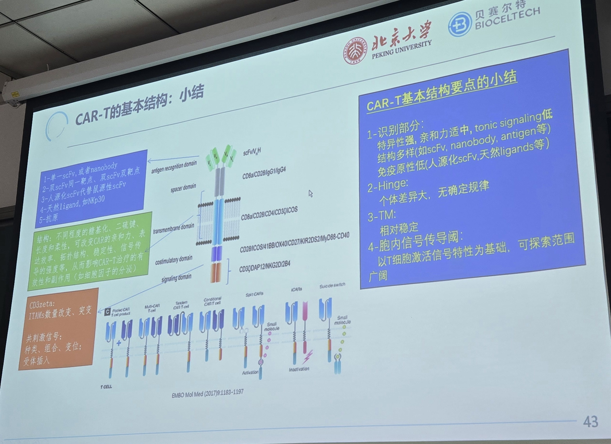
    
14. 新一代CAR-T设计理念与思路：
    
    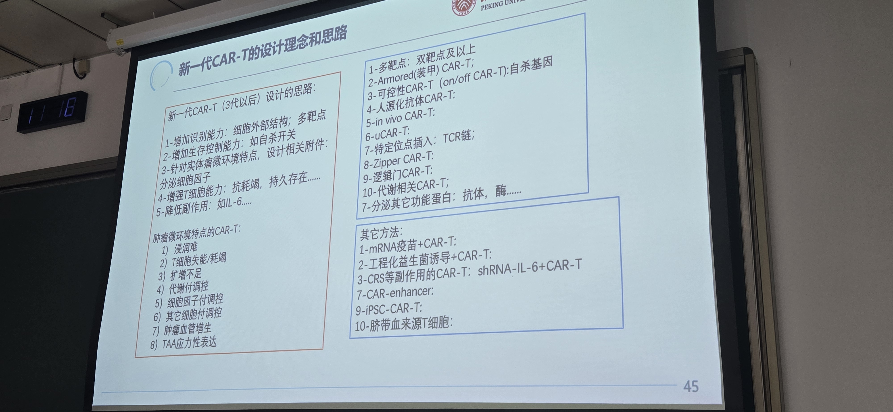
    
15. 双靶点CAR-T：串联、并联同抗原的两个靶点；Armored CAR-T（TRUCK CAR-T）：赋予CAR-T细胞一个装备，使其作用更加强大。分泌细胞因子或趋化因子；PD-1+CAR：分泌scFv的CAR-T细胞具有旁分泌性和自分泌性；ICR/CAR-T倒置细胞因子受体CAR-T：负调控因子受体的胞外结构+正调控因子受体的胞内结构。TME中，IL-4，IL-10，TGFB负调控细胞因子含量高，变负为正后，刺激T细胞扩增、增加杀伤力。IL-7，IL-21等为正调控因子。CAR-T2A-tIL4R(extra)-tlL7R(intra)，其有强烈杀瘤作用，CAR/ICR细胞增殖明显，并虽肿瘤减小，IL-4减少而数量减低；减毒CAR-T：IL-6、IL-1、GM-CSF引起CRS和CRES，降低或消除其表达可减轻副作用。如shRNA+CAR-T、CAR-T with IL-1-R、GM-CSFk/o CAR-Ts；逻辑门管控CAR-T：双靶点，可为两个不同靶点，也可为同一靶点但亲和力高低不同。如双TAA靶点，分裂的信号阈——“And” gate，一个结合杀伤信号弱，共刺激信号+CD3 zeta才加强杀伤作用。1个TAA加sensor，低pH敏感（Her2）、低氧敏感（HIF1α亚基）、肿瘤相关蛋白酶（TGF-β）；表观遗传学修饰。1个TAA、一个负调控信号——“Not” gate。synNotch——“If/then”gate；ZipFv CAR-T：模块化、通用；In vivo CAR-T：将CAR-T组件直接注射到机体，在体内转染T细胞，形成CAR-T细胞，并进行扩增治疗。CAR-T组件的形式有CAR组件（DNA、mRNA、环形RNA）和delivery system（慢病毒载体LV、脂质纳米颗粒LNP、合成聚合物纳米载体NC、腺病毒相关载体AAV、外泌体Exosome。LNP基本原理为：结构脂质+辅助脂质+靶向配体混合而成，靶向配体与靶细胞表面标志物结合，形成特异结合和递送。靶向配体可以为抗体、肽、小分子配体等；外泌体可以为自然产生的靶向外泌体，即由源细胞产生时的自带靶向配体蛋白，也可以为工程化靶向外泌体，如物理、化学、基因工程制备的配体靶向外泌体）
16. 在in vivo CAR-T中，plasmid DNA技术成熟、DNA整合与持久表达、安全性低、免疫原性中等、自身稳定性高；线性mRNA技术较成熟、短期高效表达，不整合、安全性高、免疫原性低至中等、自身稳定性差；circRNA技术不太成熟、长期稳定，不整合、安全性高、免疫原性低、自身稳定性中至高。
17. uCAR-T：
    
    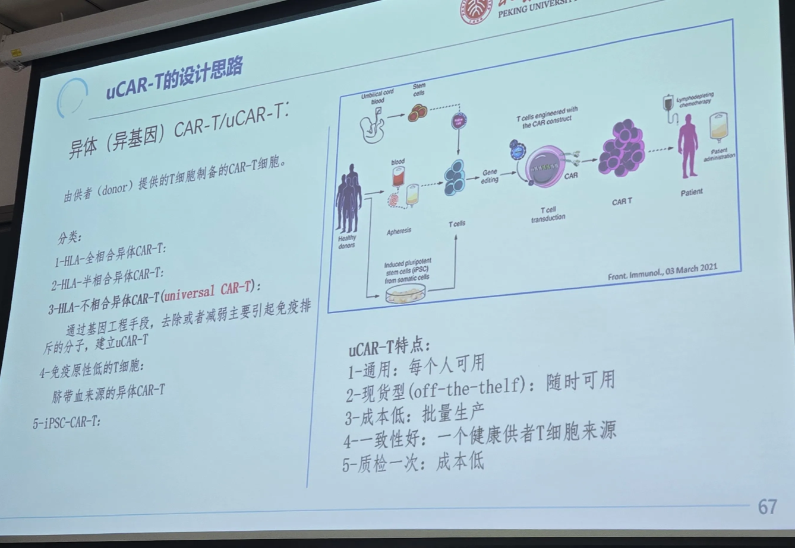
    
    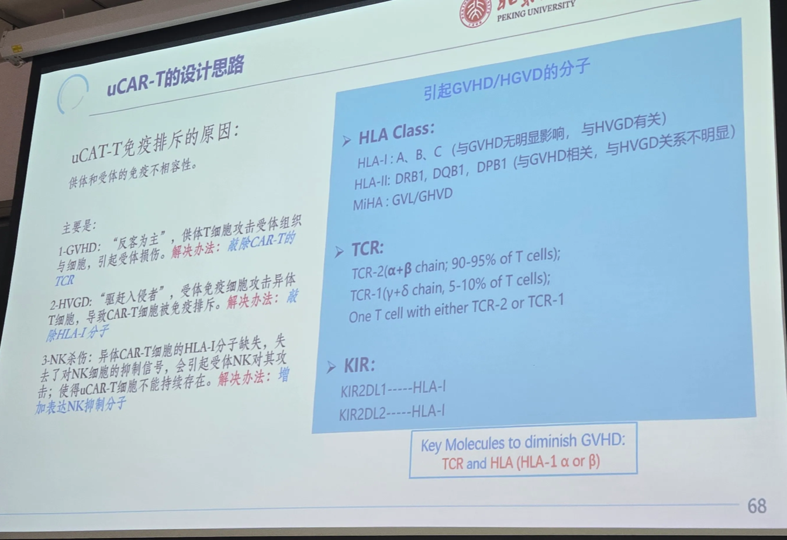
    
    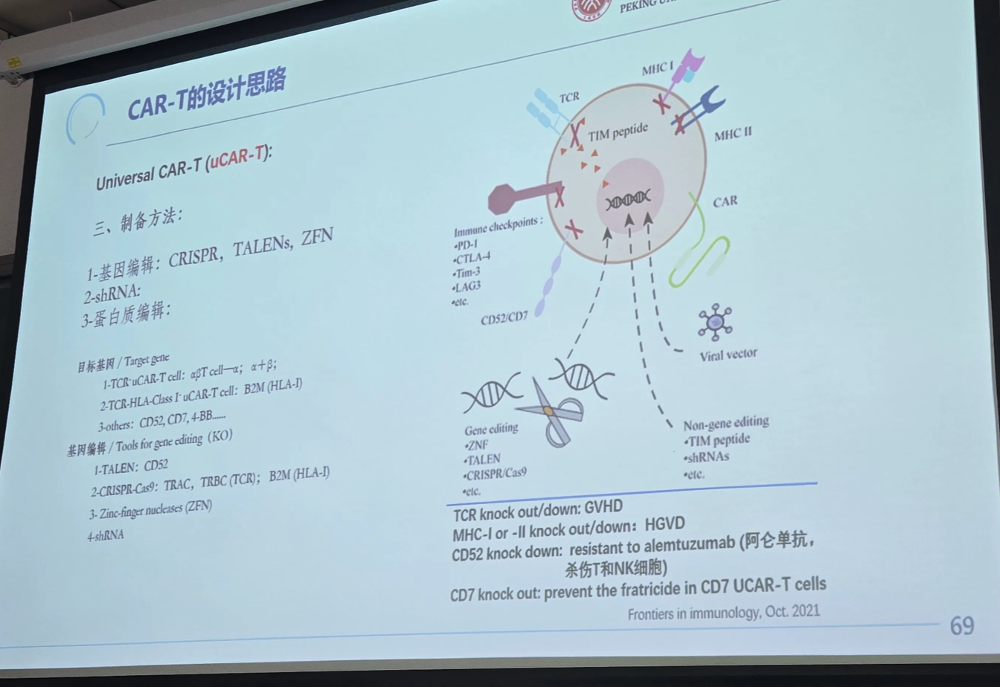
    
    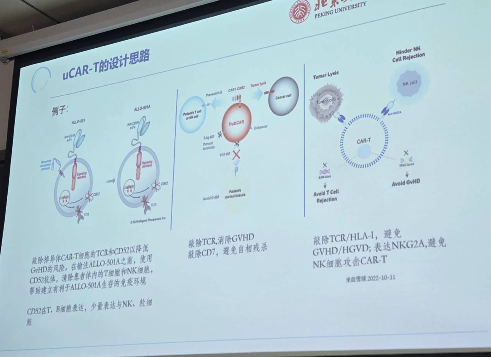
    
18. 

# 专题：化疗

---

### 11月8日/13日

1. 化疗（非针对性的对所有快速分裂细胞作用）副作用：快速分裂的正常细胞（毛囊细胞，导致脱发、粘膜细胞，导致恶心呕吐、免疫细胞，导致免疫抑制）和缓慢分裂的肿瘤细胞（肾癌、前列腺癌，长期使用低剂量化疗控制肿瘤生长。肿瘤干细胞，有复发可能）
2. 肿瘤细胞抗药性：改变药物代谢、包裹药物至囊泡后排出等
    
    
    
3. 化疗对免疫系统的作用：骨髓移植——化疗导致骨髓活性降低，即骨髓抑制，从而减少白细胞、红细胞和血小板的产生。白细胞（尤其中性粒细胞）水平较低会使患者更容易受到感染，因为免疫系统被削弱，无法有效应对病原体；淋巴细胞耗竭——一些化疗药物对淋巴细胞（T、B、NK）毒性很大，降低适应性免疫反应。淋巴细胞耗竭会削弱免疫系统识别和摧毁癌细胞的能力，使其在消除残留癌细胞或预防复发方面效果较差
4. 免疫系统对化疗反应：炎症和细胞因子释放——化疗可引发炎症反应，导致细胞因子（免疫信号分子）的释放。其中一些细胞因子，如白细胞介素6和肿瘤坏死因子α，可导致化疗相关的副作用（如发烧、疲劳和恶心）。这种炎症反应有时会增强免疫反应，但也会导致免疫抑制；肿瘤细胞抗原释放——化疗杀死癌细胞时，可导致肿瘤细胞释放抗原（免疫系统识别为外来蛋白质）。这些抗原可能有助于“教导”免疫系统识别和攻击癌细胞，从而有助于控制或缓解癌症；免疫监视增强——某些情况下，化疗诱导的肿瘤细胞死亡可刺激免疫监视机制，激活某些免疫细胞识别和靶向残留癌细胞。这种现象被称为免疫原性细胞死亡，它可以通过“警告”免疫系统注意残留的癌细胞来改善癌症的长期效果
5. 化疗的临床事实：患者免疫系统的完整性对保证化疗的疗效至关重要；化疗的抗肿瘤效果依赖于肿瘤与机体机能的相互作用；克服肿瘤诱导的免疫耐受可使免疫系统重新发挥肿瘤监视作用并阻止肿瘤扩散与复发；一些化疗药具有诱导肿瘤细胞发生免疫性凋亡的能力，使得凋亡的肿瘤细胞成为较好的内源性疫苗；一些化疗药通过诱导淋巴细胞清除产生伴随的免疫刺激效果；一些化疗药与免疫细胞治疗联合有显著的协同/拮抗效果
6. 化疗药物诱导肿瘤发生免疫原性细胞死亡，可通过上调MHC，肿瘤相关抗原和共刺激分子诱导免疫反应。化疗药物诱导的ICD包括：ER应激、自噬、CRT易位、ATP/HMGB1释放、产生I型干扰素
7. 内源性危险信号是细胞在应激情况下释放的可以诱发免疫应答的分子，化疗导致肿瘤细胞死亡可以诱发抗肿瘤免疫应答
8. 肿瘤免疫逃逸：
    
    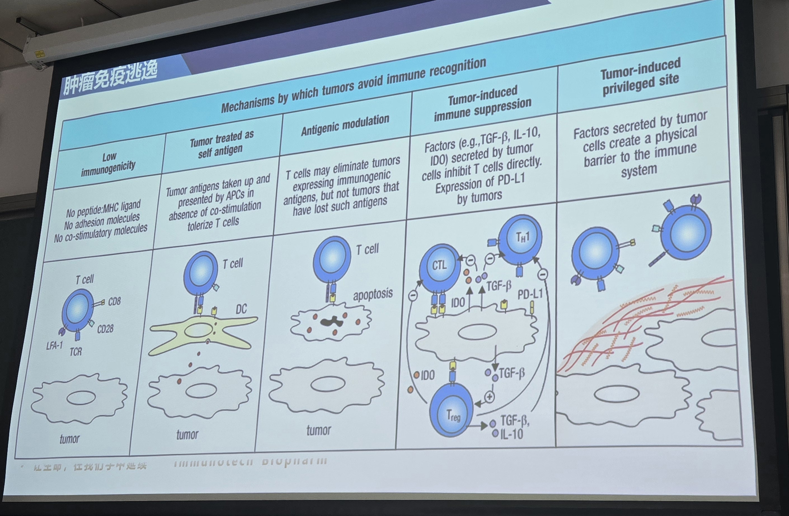
    
9. 诱导ICD的化疗药物：
    
    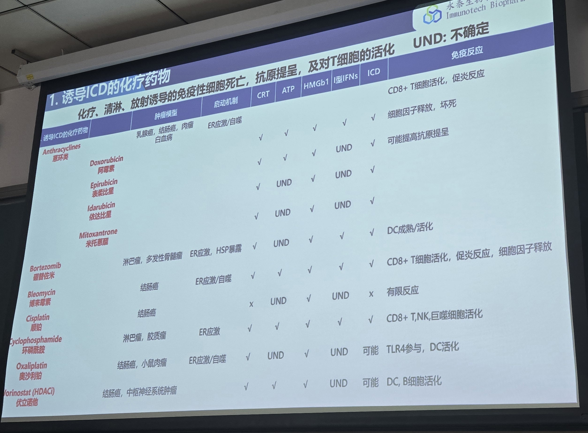
    
10. 清淋化疗：使用环磷酰胺和氟达拉滨/（或使用全身化疗）清除患者体内淋巴细胞，同时尽可能少地影响骨髓造血细胞的再生功能
    
    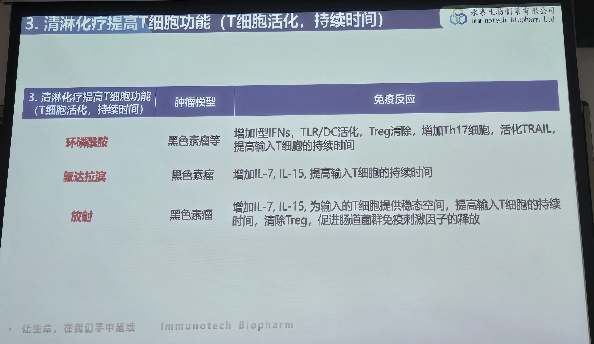
    
11. 放射治疗作为免疫刺激方式，可促进抗原释放、提呈，T细胞激活/活化
12. TIL、CAR-T、TCR-T细胞治疗前清淋化疗/放疗的作用机制：
13. 化疗期间增强免疫的策略：免疫疗法联合治疗——将化疗和免疫疗法（ICB、CIK等）联合使用。免疫疗法通过刺激免疫系统识别和攻击癌细胞来发挥作用。与化疗结合时，免疫疗法可增强对癌症的免疫反应，从而可能改善治疗效果；造血生长因子——G-CSF等药物可刺激骨髓产生更多的白细胞，有助于降低感染风险并在化疗期间保持更强大的免疫系统；时间和剂量调整——调整化疗时间或剂量，尤其是与免疫疗法同时使用时，可能有助于优化免疫反应并最大限度减少免疫抑制作用
14. 依据药物作用机制设计肿瘤综合治疗方案：免疫治疗药物之间的联合——抗PD-1+抗CTLA-4、抗PD-1+免疫细胞、溶瘤病毒（产生局部危险信号）+免疫细胞；常规治疗+免疫治疗——手术/介入+免疫治疗、化疗+免疫治疗、靶向治疗+免疫治疗、化疗+靶向+免疫。联合使用时，需要考虑药物之间可能的协同作用或拮抗作用
15. 化疗与免疫治疗的时机选择：
    
    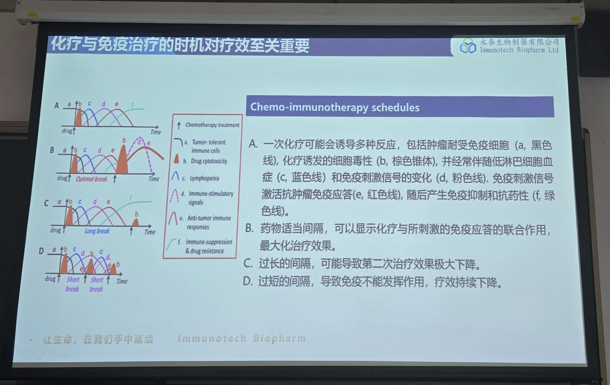
    
16. 小结：化疗会改变免疫细胞的组成、表型和功能；免疫系统是决定化疗是否成功的重要因素；免疫治疗与免疫调节剂往往与化疗具有协同作用；免疫治疗和免疫调节剂的耐药机制尚不完全明确；靶向肿瘤和免疫细胞的联合方案可能是控制肿瘤的关键

# 专题：肿瘤动物模型

---

### 11月11日

1. 动物模型：近交系遗传物质相似
    
    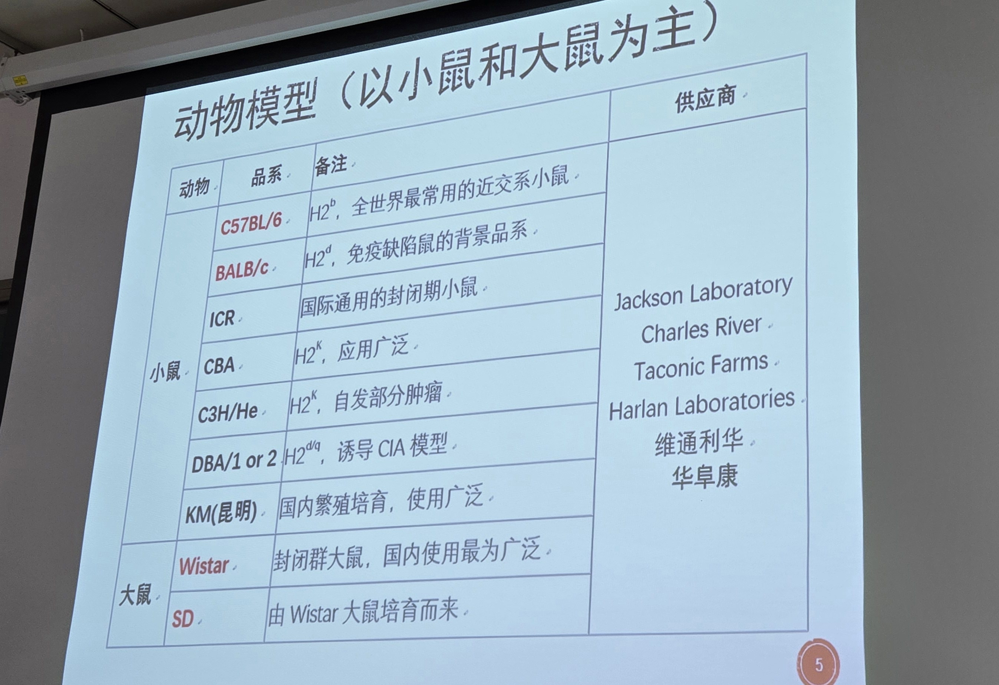
    
2. 几种自发性乳腺癌小鼠模型：C3H小鼠——繁殖雌鼠自发性乳腺癌发生率为80-100%、A系小鼠——经产雌鼠乳腺肿瘤发生率80-84%、DBA小鼠——雌鼠自发乳腺癌发生率为50-75%、CBA小鼠——雌鼠自发性乳腺癌发生率60-65%；自发性白血病小鼠模型：AKR小鼠——8-9月龄白血病发生率80-90%、Afb小鼠——8-9月龄白血病发生率雌性90%，雄性65%、C58系小鼠——12月龄白血病发生率95-97%
3. 常用肿瘤模型小鼠肿瘤自然发生率：
    
    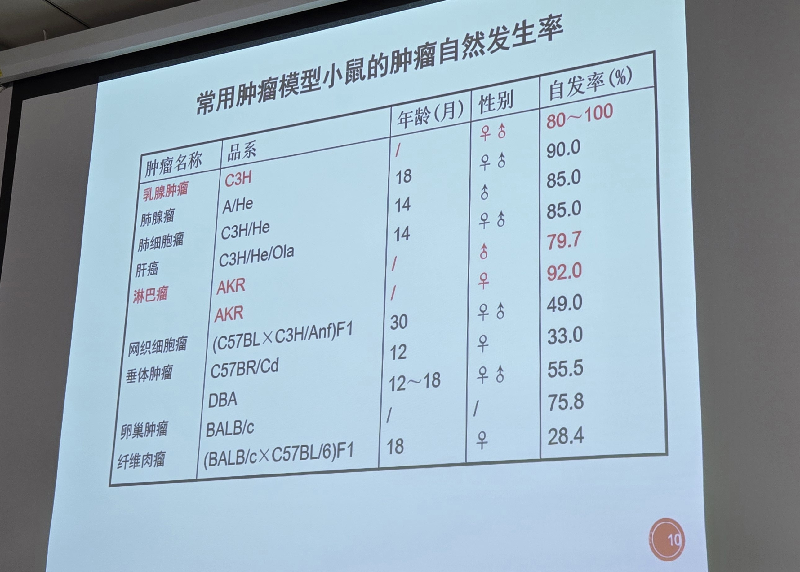
    
4. 自发性肿瘤动物模型特点：优点——动物自发性模型时近似人类肿瘤发生学的模型，其肿瘤发生学及细胞动力学特点与人类肿瘤较接进；这类模型便于进行慢性治疗试验，自发性肿瘤与移植性肿瘤相比，对药物的敏感度不太高，疗程长，便于进行综合治疗；这类肿瘤发生条件较为自然，有可能通过细致观察和统计分析而发生原先没有发现的环境致癌因素或其他致癌因素，可以着重观察遗传因素在肿瘤上的作用。缺点——肿瘤发生情况不齐，且很难在短时间内获得大量肿瘤学材料，观察时间较长，实验耗材较多；通常动物个体之间肿瘤的生长速度差异较大，难于评价治疗效果。
5. 诱发性肿瘤动物模型：在实验条件下，使用致癌物诱发动物发生肿瘤。利用外源性致癌物质引起细胞遗传特性改变，从而出现异常生长和高增殖活性细胞，形成肿瘤。外源性致癌物质主要有化学性、物理性（放射性物质）及生物性（如诱发动物肿瘤的病毒），其中以化学致癌物最为常用
6. AOM联合DSS诱导结肠/直肠癌模型；DEN（诱导基因突变，仅出生后14日）和/或CCL4联合诱导肝癌模型（炎癌转化模型示例）
7. 诱发性肿瘤动物模型特点：优点——该模型诱发因素和条件人为可控，诱发率远高于自然发病率；常应用于验证可疑致癌因素的作用及在肿瘤病因学及肿瘤预防研究（约80%患者肿瘤由环境因素引起）；缺点——诱导时间长（3-5月，甚至1-2年），部分成瘤率不高；动物死亡率高、花费大；肿瘤出现的时间、部位、病灶数等在个体之间表型不一；诱导剂有毒，需谨慎操作（需将未治疗的动物作为治疗动物的对照）
8. 同种动物移植性肿瘤模型：筛选抗癌药物时，最好选用3类瘤株，即肉瘤、腹水型肿瘤和白血病株。目前使用最广的为——小鼠Lewis肿瘤、小鼠黑色素瘤B16、小鼠白血病P388。瘤株或细胞系的选择应尽量考虑与临床拟研究肿瘤的性质、部位等相近，如拟研究肝癌的治疗，可首选肝癌瘤株
9. 常用接种部位：实体瘤——腋窝皮下；肌肉接种——大腿肌肉；腹水型肿瘤——腹腔
10. 瘤块接种法：瘤源动物—>颈椎脱臼处死—>消毒切开皮肤—>取瘤剪成2mm³小块—>用套管针抽吸瘤块—>接种于受体动物右前肢腋窝皮下。注意不用瘤中央的坏死部分，缩短接种操作时间，从瘤块取材到接种完毕一般应在30min内，平皿内放置少许灭菌PBS或其他营养液，接种部位皮肤应先消毒，黑色素瘤则成黑色或黑紫色
11. 瘤细胞悬液接种法：如每次需要接种的动物数量较多时，可用瘤细胞悬液接种：取几个瘤块—>除去坏死部分—>混合瘤块—>剪成小块—>匀浆器单向研匀—>放入无菌容器—>生理盐水稀释成1:3~1:4悬液。每只动物接种0.2ml，整个操作应在30min内完成，每个抽吸前应将细胞混匀
12. 培养细胞接种法：在对数生长期取细胞
13. 腹水型肿瘤接种法：抽出的腹水应为乳白色浓稠液体，若为黄色或含有大量红细胞时除去
14. 动物移植性肿瘤特点：优点——模型复制简便；移植瘤保持着原发肿瘤的大部分生物学特性；动物个体成癌差异较小，成瘤率高，实验周期短；缺点——肿瘤增殖时间短，与人类肿瘤不同；人体肿瘤的所有细胞亚群不能全部出现在移植瘤中
15. 基因修饰动物模型：利用基因修饰技术获得人类肿瘤或肿瘤易感小鼠模型。肿瘤转基因动物模型有：显微注射法、逆转录病毒感染法、精子载体法、体细胞核移植法、胞质内精子微注射介导和胚胎干细胞法。基因修饰动物模型转染癌基因及促进肿瘤发生发展的基因、转入肿瘤血管生成调控基因、转入肿瘤转移促进基因，主要是金属基质蛋白酶、转入肿瘤细胞耐药相关基因
16. 基因敲除动物模型：传统ES打靶、TALEN、CRISPR/Cas9、TetraOneTM，多敲除抑癌基因：
    
    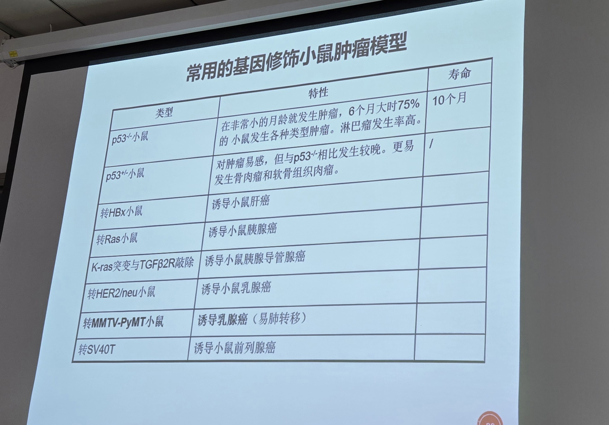
    
17. 基因修饰肿瘤动物模型特点：优点——模型小鼠遗传背景单一；突变效应不参杂其他体细胞突变的影响；利用条件性基因表达调控组件可对不同生长期、不同组织器官内肿瘤的发生发展进行探讨。缺点——生长特性与人体肿瘤有差别；模型建立过程较长，费用较高
18. 肿瘤细胞有多种生物学特性，其中侵袭和转移时最重要的特性之一，也是恶性肿瘤的标志。肿瘤侵袭：恶性肿瘤细胞突破基膜和ECM构成的组织学屏障，侵犯到邻近的正常组织，并在该处继续繁殖生长的过程侵袭是贯穿肿瘤转移全过程的重要步骤，瘤细胞穿入、穿出血管或淋巴管和侵入靶器官都是侵袭行为的具体表现。肿瘤转移：恶性肿瘤细胞借助血道、淋巴道等途径，在远离肿瘤原发生长部位形成继发瘤的过程
19. 肿瘤侵袭常用动物模型：小鼠子宫颈癌U14肾侵袭模型，多以昆明小鼠为主，小鼠子宫颈癌U14为实体型，具有血液和淋巴系统双重转移特点，淋巴转移率>90%，并可发生肺转移，但自发转移率不高；W256癌肉瘤骨侵袭模型；肿瘤细胞侵袭的其他常用体内模型——皮下移植、肌肉内移植、腹腔内移植、睾丸包膜下移植、小鼠耳廓皮下移植、小鼠尾部皮下移植、爪垫皮下移植、视网内界膜侵袭模型等
20. 肿瘤转移常用动物模型：B16-BL6小鼠黑色素瘤自发转移模型，主要发生肺转移，可反映瘤“细胞侵袭-血行播散-侵袭”的完整转移过程；Lewis肺癌自发性肺转移模型，Lewis肺癌种植于动物皮下后可通过血行播散到肺部形成转移灶，故常被用作肿瘤血行转移研究的模型；LA-795小鼠肺腺癌转移模型；小鼠黑色素瘤B16-F10实验性肺转移模型，B16-F10是从B16细胞中筛选出的肺部高转移克隆株
21. 免疫缺陷动物：指由于先天性遗传突变或用人工方法造成一种或多种免疫系统组成成分缺陷的动物。免疫缺陷动物分类：先天性免疫缺陷动物（T淋巴细胞功能缺陷动物——裸小鼠、裸大鼠；B淋巴细胞功能缺陷动物——CBA/N小鼠；NK细胞功能缺陷动物——Beige小鼠；联合免疫缺陷动物——SCID小鼠、NOD-SCID小鼠）；获得性免疫缺陷及其相关的AIDS动物模型（小鼠、黑猩猩、猴的HIV感染模型）
22. 人源肿瘤细胞系异种移植模型（CDX model）：将肿瘤细胞系移植
23. 人源肿瘤组织异种移植模型（PDX model）：保留患者肿瘤的分子表型和基因表现、再现原发肿瘤的异质性、广泛用于肿瘤耐药机制和药物筛选。优点——保留了患者肿瘤的基质异质性和组织学特性，为肿瘤研究提供体内模拟环境（癌细胞形态、基质富集、淋巴和血管系统以及坏死区域等），能更客观和全面地反映肿瘤的发展以及对于药物作用的反应；缺点——成本和周期长，一个个体化肿瘤异种移植模型的建立至少需要2个月，技术难度较大且成瘤率相对较低，操作相对较为复杂，特别是肾包膜等部位的异位移植，种植的肿瘤出现转移的情况比较少：
    
    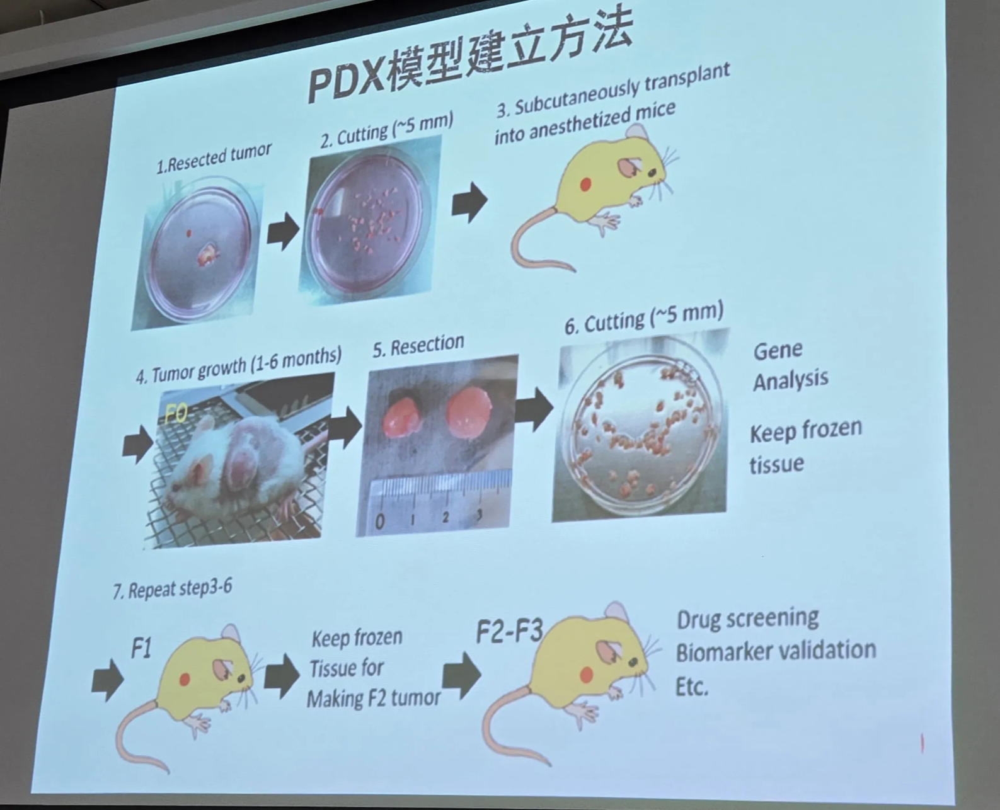
    
24. 人源化小鼠模型与肿瘤研究：人源化小鼠模型是指带有人类功能性基因、细胞或组织的小鼠模型。这种模型通常作为研究人类疾病的活体替代模型，在阐明发病机制、药物筛选等方面具有巨大的优势和广泛的应用前景。由于免疫缺陷小鼠缺乏免疫力，相对容易接受异种细胞或组织，作为人源化动物模型应用性强
25. 人源化小鼠的重建策略：供者材料类型：脐带血、骨髓、胎肝或G-CSF处理过的成人外周血。受者小鼠的选择和预处理：新生小鼠、尾静脉注射、射线照射（1Gy）。辅助策略：注射可溶性细胞因子，如IL-15促进T细胞，GM-CSF等；构建病毒载体，如IL-15腺病毒载体；高压注射基因表达质粒，如人IL-15和Flt3l表达载体诱导NK细胞
26. 人源化小鼠可用于淋巴瘤研究，  可用于临床前肿瘤免疫疗法的效果评估（如将人源修饰T细胞输入人源肿瘤细胞的成瘤小鼠体内进行评估）

# 专题：放疗

---

### 11月13日

1. 辐射可致细胞死亡，并且生长旺盛的细胞对辐射更为敏感。放疗可分全身性放疗（骨髓移植、免疫细胞治疗前的conditioning）与局部放疗（精准定位）
2. 局部放疗可诱导全身性免疫应答，具有远端效应
3. 放疗引起细胞死亡的直接或间接方式：
    
    
    
4. 放疗直接引起细胞死亡——非免疫性杀伤：
    
    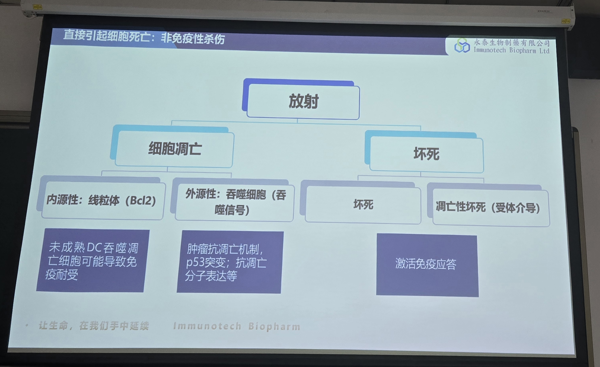
    
5. 通过DNA损伤致细胞死亡——非免疫性杀伤自愈：
    
    
    
6. 放疗分割与免疫反应：
    
    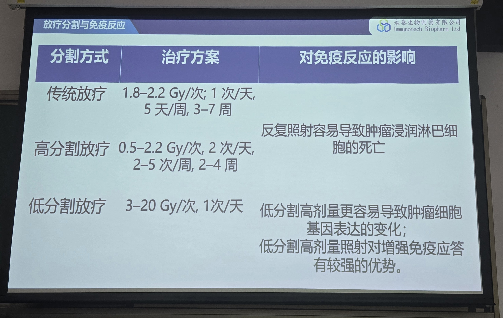
    
7. 放疗诱导的免疫反应：
    
    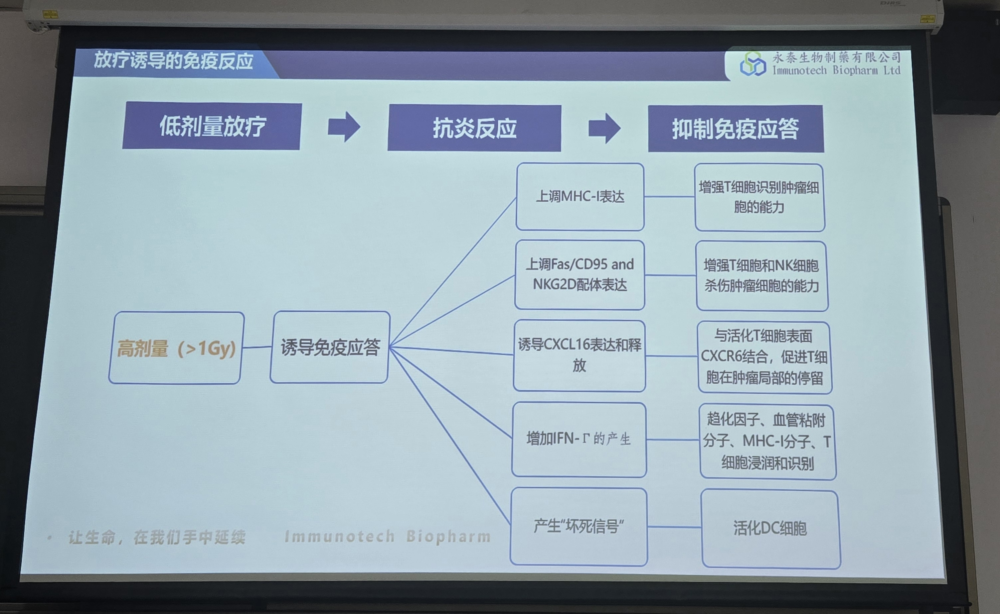
    
8. 肿瘤免疫逃逸机制：内因——MHC-I类分子缺失、抗原提呈机能缺失（TAP，ERAPs）、肿瘤相关抗原缺失、预警蛋白脱落（NKG2D）、抗凋亡分子上调（cFLIP，IAPs）、免疫抑制信号分子上调（PDL1，CD200，HLA-E）；外因——免疫抑制细胞浸润（Treg，MDSCs）、免疫反应受体失活（TCR的腈化或与galectins结合）、营养成分匮乏（IDO，缺氧）、免疫抑制性细胞因子（TGF-β，IL-10，VEGF）
9. RT的副作用：免疫相关性肺炎（间质性肺炎）、免疫相关性胃肠道反应（严重腹泻）、序贯治疗的考虑

# 专题：

---

### 11月15日

1. 肿瘤抗原的发现和确证：多肽洗脱法——直接用酸处理肿瘤细胞、细胞表面MHC分子结合的天然抗原肽被洗脱下来、用高效液相色谱、；表位预测法——正常细胞和肿瘤细胞的基因表达谱分析（抑制性扣除杂交、mRNA差异显示技术、cDNA减法杂交）、筛选肿瘤过表达基因、；噬菌体组合肽库技术——构建噬菌体肽库、生物淘选、扩增和鉴定功能验证；特异性细胞毒T细胞识别筛选分离抗原技术——肿瘤细胞与TILs共培养获得CTL、；特异性抗体结合获取抗原技术——通过补体介导杀伤肿瘤细胞、单克隆抗体免疫亲和层析法、重组cDNA表达的自体肿瘤抗原的血清学分析技术（SEREX）；生物信息学和蛋白质学高通量筛选技术——外显子/RNA测序分析、突变新生抗原的筛选、新生抗原的免疫原性评估、T细胞应答评估、合成多肽疫苗
2. 肿瘤抗原应用：免疫诊断——体内放射性标记抗体检测肿瘤、体外肿瘤标志物的检测，如AFP、CEA等；免疫治疗——肿瘤疫苗的制备、靶向治疗、过继免疫细胞治疗等
3. 抗肿瘤免疫机制：机体对肿瘤的免疫应答取决于肿瘤免疫原性、肿瘤微环境和宿主的免疫功能等多种因素。机体针对肿瘤可产生固有免疫应答，也可以针对肿瘤抗原的适应性免疫应答。一般认为细胞命运是抗肿瘤免疫的主力，体液免疫起协同作用
4. 特异性抗肿瘤免疫效应细胞：CTL、Th1 T细胞、B细胞、DC细胞；非特异性抗肿瘤免疫效应细胞：M2 Macrophage、中性粒细胞
5. CTL/NK细胞杀伤活性检测：
    
    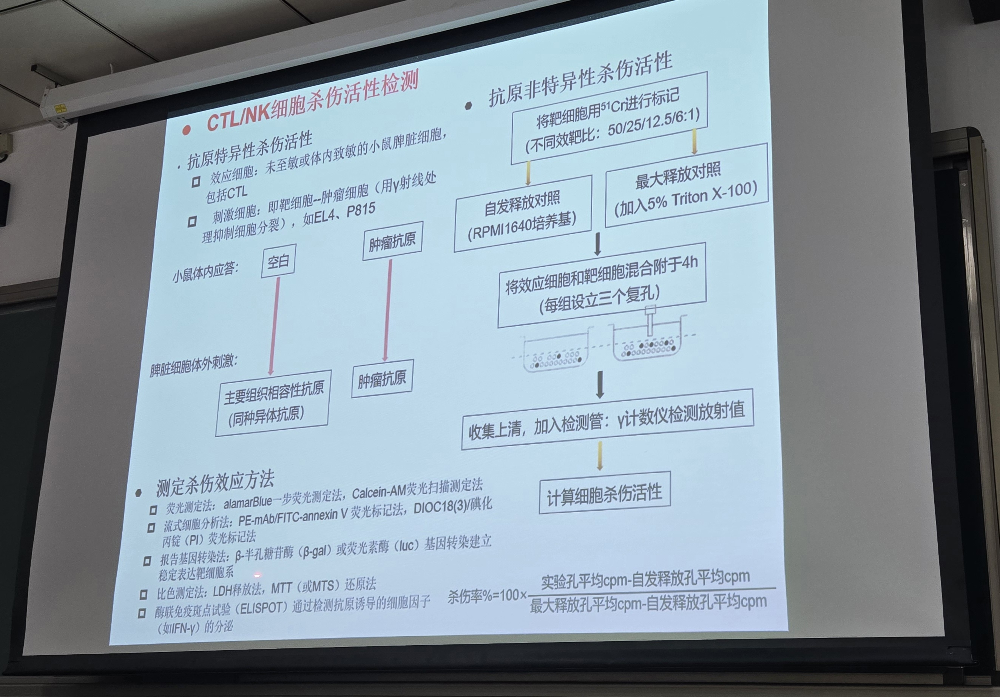
    
6. 合成T细胞受体抗原受体（STAR），STAR-T细胞不仅具有特异性杀伤功能，同时还能保持增殖能力
7. CAR-T设计：                                                                                                                                                                                                                                                                                                                                                                                                                                                                                                                                                                                                                                                                                                                                                                                                                                                                                                                                                                                                                                                                                                                                                                                                                                                                                                                                                                                                                                                                                                                                                                                                                                                                                                                                                                                                                                                                                                                                                                                                                                                                                                                                                                                                                                                                                                                                                                                                                                                                                                                                                                                                                                                                                                                                                                                                                                                                                                                                                                                                                                                                                                                                                                                                                                                                                                                                                                                                                                                                                                                                                                                                                                                                                                                                                                                                                                                                                                                                                                                                                                                                                                                                                                                                                                                                                                                                                                                                                                                                                                                                                                                                                                                                                                                                                                                                                                                                                                                                                                                                                                                                                                                                                                                                                                                                                                                                                                                                                                                                                                                                                                                                                                                                                                                                                                                                                                                                                                                                                                                                                                                                                                                                                                                                                                                                                                                                                                                                                           
    
    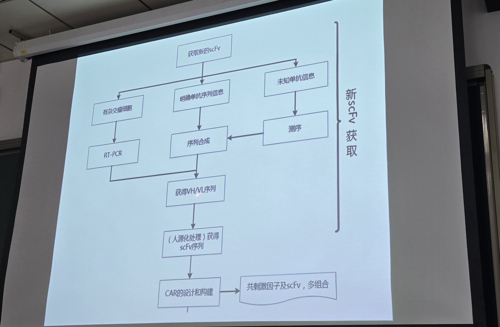
    

---

[Sub Page](https://www.notion.so/Sub-Page-684d485593a345548146e6c42eada842?pvs=21)

# Tmp repository

---

- NASH-HCC机制综述
    
    [Frontiers | The Pathogenesis of HCC Driven by NASH and the Preventive and Therapeutic Effects of Natural Products](https://www.frontiersin.org/journals/pharmacology/articles/10.3389/fphar.2022.944088/full)
    
    [Nonalcoholic steatohepatitis-related hepatocellular carcinoma: pathogenesis and treatment](https://www.nature.com/articles/s41575-023-00754-7#Sec5)
    
-